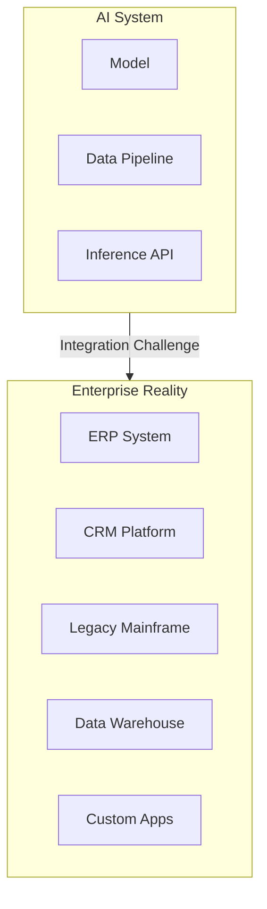
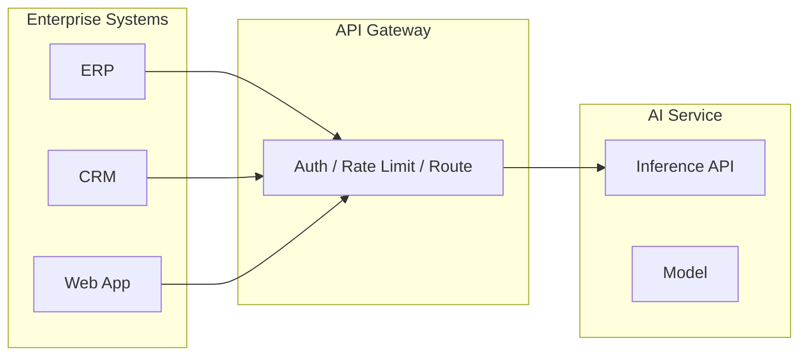
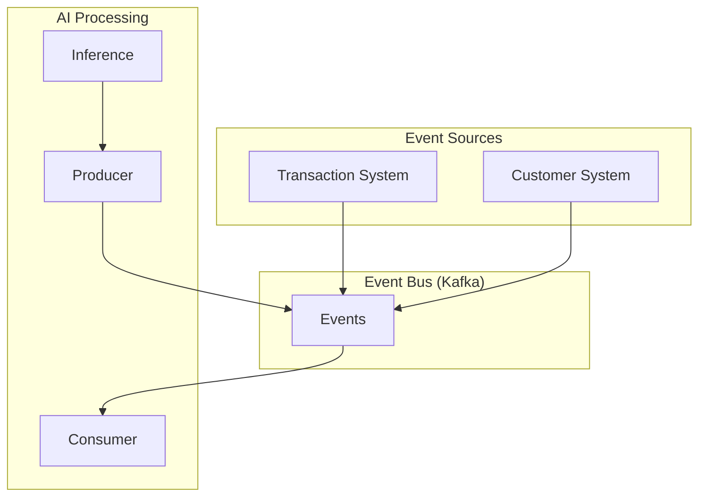
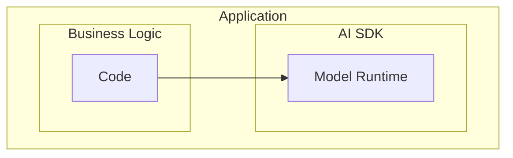
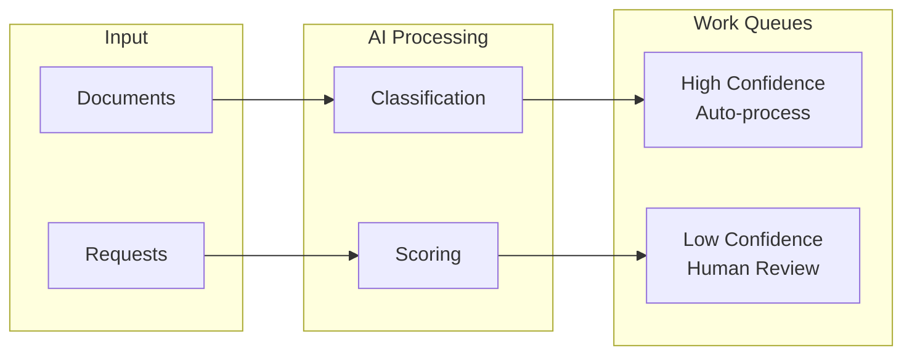

# AI Integration Patterns for Enterprise Systems

## Integrating AI into existing enterprise systems is harder than building AI from scratch. Here are the patterns that work—and the anti-patterns that don't.

Building AI is one challenge. Integrating it into decades of existing enterprise systems is another entirely.

The AI works perfectly in the lab. Then it meets SAP, Salesforce, a mainframe from 1987, three middleware platforms, and a security architecture that doesn't trust anything new.

Here are the patterns that actually work.

---

## The Integration Challenge

Enterprise systems have multiple data formats, complex security, change management processes, and decades of accumulated customization.

AI systems need real-time data access, low-latency inference, feedback loops, and monitoring.

---

## Pattern 1: API Gateway Integration

Put the AI behind a standard API that looks like any other enterprise service.

**When to use:** AI provides discrete predictions, multiple systems need capability, standard request/response works.

---

## Pattern 2: Event-Driven Integration

AI reacts to events in the enterprise event stream.

**When to use:** AI processes streams, results feed workflows, loose coupling desired.

---

## Pattern 3: Database Integration

AI reads from and writes to shared databases.

**When to use:** Batch processing acceptable, applications already use shared databases.

**Key principle:** Use separate tables for AI outputs. Don't modify operational data directly.

---

## Pattern 4: Embedded AI

AI runs inside the application, not as a separate service.

**When to use:** Ultra-low latency required, small model, offline operation needed.

---

## Pattern 5: Human-in-the-Loop Queue

AI feeds a work queue for human review and action.

**When to use:** Decisions require oversight, confidence varies, regulatory requirements.

---

## Pattern 6: Sidecar/Advisor Pattern

AI provides recommendations that applications can use or ignore.

**When to use:** AI augments but doesn't control, gradual adoption desired, fallback needed.

> "Start optional, prove value, then increase influence."

---

## Anti-Patterns to Avoid

### 1. Direct Model Access

Exposing models directly without a service layer. Models change; APIs should be stable.

### 2. Big Bang Integration

Trying to integrate AI everywhere at once. Too much change, can't isolate failures.

### 3. Ignoring Failure Modes

Assuming AI will always be available and correct. Plan for graceful degradation.

### 4. Synchronous Chains

Long synchronous chains where AI is in the critical path. AI latency affects entire chain.

---

## Integration Checklist

| Consideration | Questions |
|---------------|-----------|
| Data flow | Where does input come from? Where do results go? |
| Latency | What response time is required? |
| Availability | What happens when AI is unavailable? |
| Security | How is access controlled? |
| Monitoring | How will you know if it's working? |
| Versioning | How will model updates be handled? |
| Rollback | Can you revert to previous behavior? |

---

## The Bottom Line

AI integration is an architecture problem, not just an AI problem. The patterns that work:

1. **Loose coupling** through APIs and events
2. **Graceful degradation** when AI fails
3. **Human oversight** for critical decisions
4. **Incremental adoption** to reduce risk
5. **Proper monitoring** for AI-specific concerns

> "Build the integration architecture before optimizing the model."

---

*ServiceVision specializes in integrating AI into existing enterprise architectures. We understand both the AI and the enterprise—and how to connect them.*

---

**Tags:** AI Integration, Enterprise Architecture, System Integration, API Design, Event-Driven Architecture, Machine Learning, MLOps, Enterprise AI, Integration Patterns, Software Architecture
