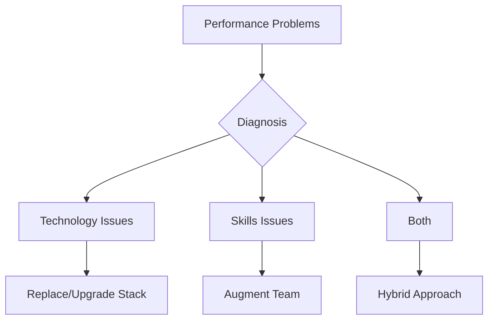
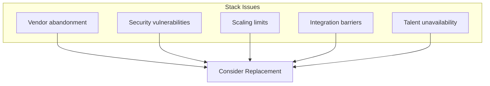
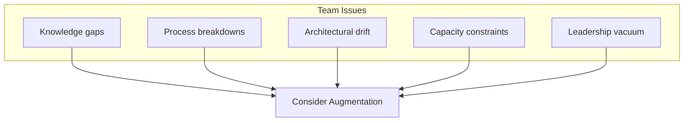
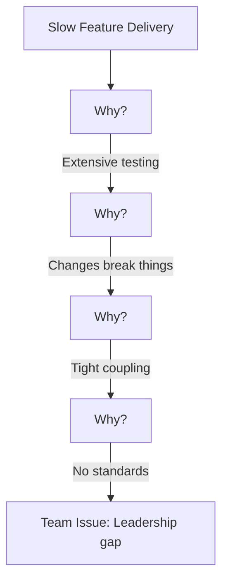
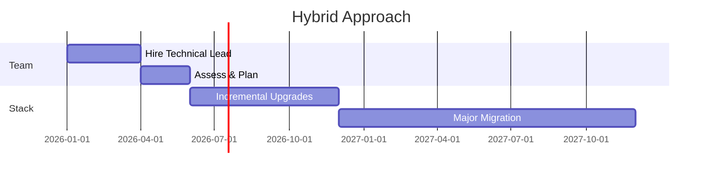

# When to Augment Your Team vs Replace Your Stack

## Your technology is struggling. But is the problem the stack or the skills? Here's how to diagnose correctly—and avoid expensive mistakes.

Your system is slow. Deployments are painful. Features take forever. Leadership is frustrated.

The debate begins: "We need to rewrite this in a modern stack" vs. "We need better developers."

Both answers can be right. Both can be expensive mistakes. Here's how to diagnose correctly.

---

## The Diagnostic Framework

The wrong diagnosis leads to wasted investment:

- Replace the stack when the problem is skills → New stack, same problems
- Add people when the problem is technology → More people fighting bad tools

---

## Signs the Stack Is the Problem

**Key indicators:**
- No recent framework releases, dwindling community
- Security audits failing repeatedly
- Performance doesn't improve despite optimization
- Integration projects consistently fail
- Months to fill positions, candidates reject offers

---

## Signs the Team Is the Problem

**Key indicators:**
- Other companies succeed with the same stack
- Same bugs keep recurring
- Code reviews show declining standards
- Team is clearly overextended
- Inconsistent patterns across codebase

---

## The Diagnosis Process

### Step 1: Gather Evidence

| Question | Data Source |
|----------|-------------|
| Is the stack capable? | Documentation, benchmarks, case studies |
| Are we using it right? | Code review, external assessment |
| What do similar companies do? | Industry research |
| Where do problems occur? | Incident analysis, metrics |
| What does the team say? | Interviews, retrospectives |

### Step 2: External Perspective

Internal teams have biases. Get external input through architecture reviews, code audits, or technical assessments.

### Step 3: Root Cause Analysis

---

## Augmentation Options

### Option 1: Training and Development

**When it works:** Gap is specific and addressable.
**Timeline:** 3-6 months to results.

### Option 2: Strategic Hires

Add specific roles—senior architect, DevOps specialist, security engineer.
**Timeline:** 3-6 months to hire, 3-6 more to impact.

### Option 3: Fractional Experts

Part-time senior talent. Get expertise without full-time commitment.
**Timeline:** Immediate to 1 month.

### Option 4: Team Extension

Add developers through agency or contractor. Increase capacity while maintaining direction.
**Timeline:** 2-4 weeks.

---

## Stack Replacement Options

### Option 1: Incremental Upgrade

Stay in ecosystem, upgrade versions, add modern tooling.
**Timeline:** 3-12 months.

### Option 2: Strangler Fig Migration

Gradually replace components while keeping system running.
**Timeline:** 12-24 months.

### Option 3: Rebuild

Start fresh with modern stack. Port data and logic.
**Timeline:** 12-36 months.
**Risk:** High.

---

## The Hybrid Path

Often the answer is both—but sequence matters.

> "Add technical leadership first. Diagnose properly with new perspective. Then execute stack changes with strengthened team."

---

## The Decision

| Diagnosis | Action |
|-----------|--------|
| Stack fundamentally limited | Plan replacement |
| Team lacks specific skills | Targeted augmentation |
| Both are issues | Fix team first, then stack |
| Neither is clear | Get external assessment |

---

## The Bottom Line

The worst outcome is guessing wrong. Take time to diagnose before committing to expensive solutions.

---

*ServiceVision provides technical assessment, team augmentation, and modernization services for established companies. We help you diagnose correctly and execute the right solution.*

---

**Tags:** Team Augmentation, Technology Stack, Technical Assessment, Software Development, Engineering Leadership, Technology Strategy, Technical Debt, System Modernization, Engineering Teams, Technology Investment
