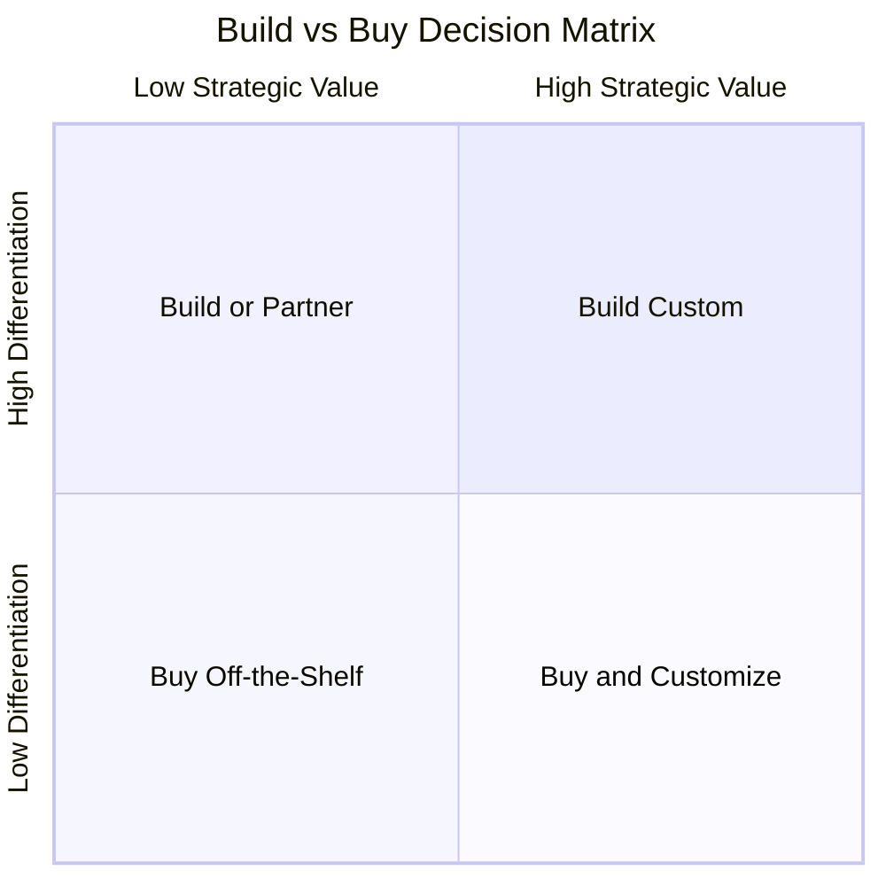
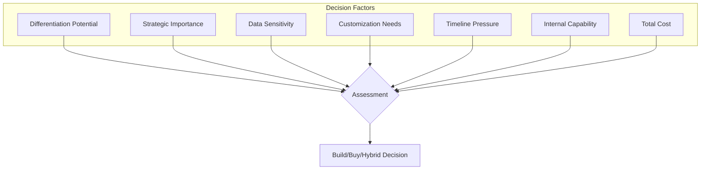
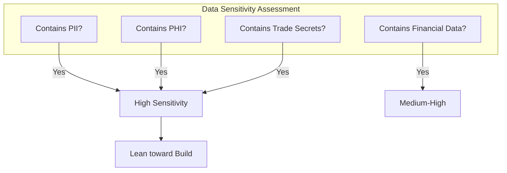
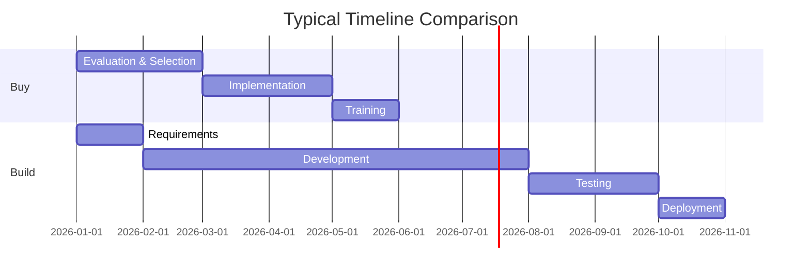
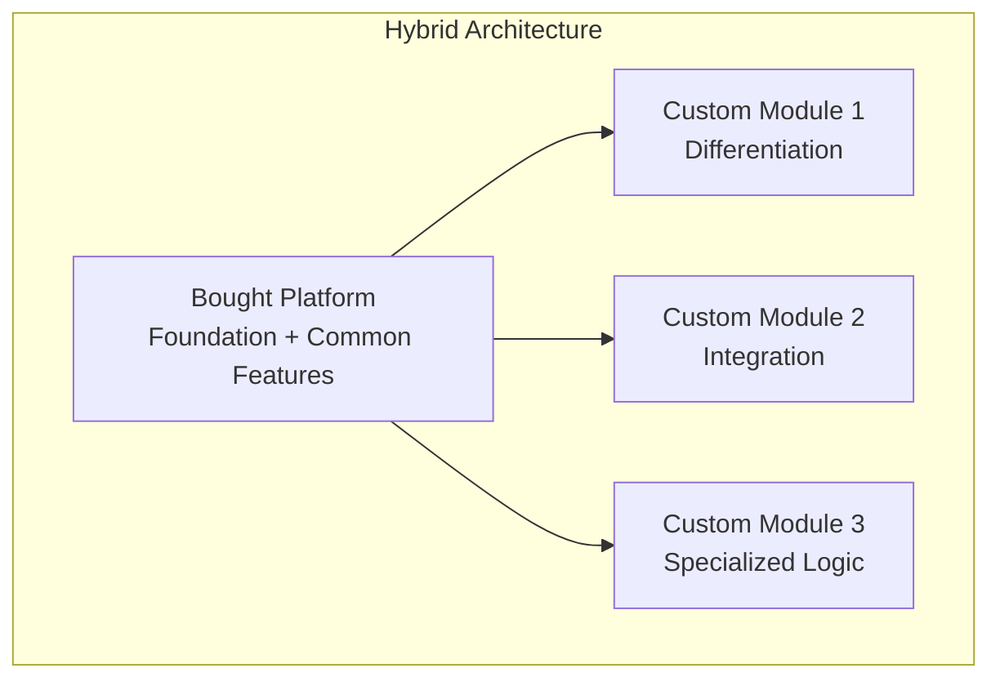
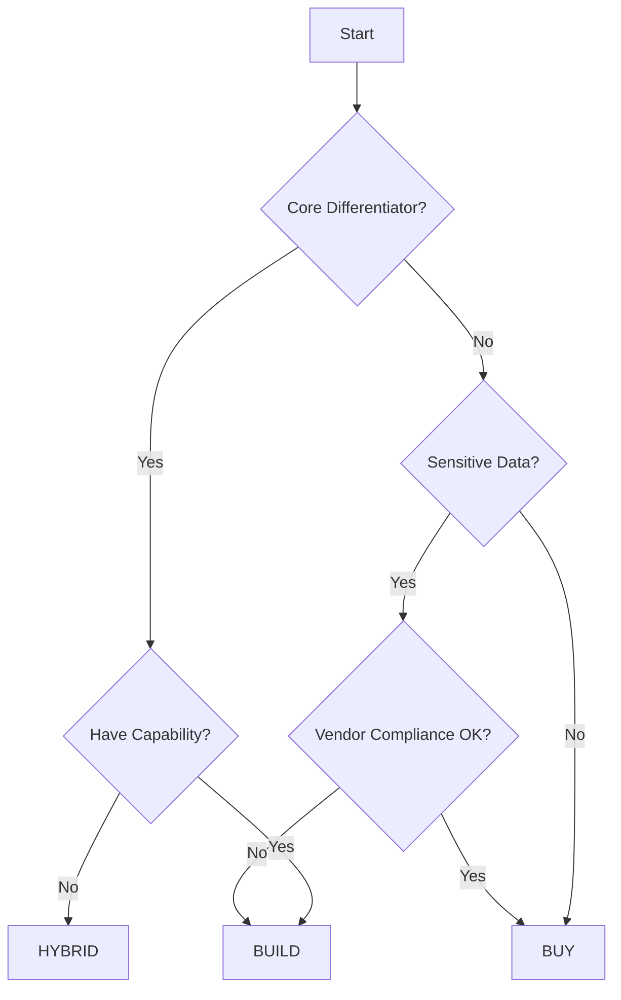

# Build vs Buy AI Solutions: A Framework for Established Companies

## Not every AI capability needs custom development. Here's how to decide when to build, when to buy, and when to do both.

Every technology leader faces this question: should we build this AI capability ourselves, or buy an existing solution?

The answer isn't obvious. Building offers control and customization. Buying offers speed and proven functionality. The wrong choice can cost millions and years.

---

## The Decision Matrix

### Quadrant Analysis

- **High Differentiation + High Strategic Value = Build Custom** — Core competitive advantage. Worth the investment.
- **High Differentiation + Low Strategic Value = Build or Partner** — Unique requirements but not core.
- **Low Differentiation + High Strategic Value = Buy and Customize** — Important but not unique.
- **Low Differentiation + Low Strategic Value = Buy Off-the-Shelf** — Commodity functionality.

---

## The Evaluation Framework

### Factor 1: Differentiation Potential

Will this AI capability differentiate you from competitors? If yes, build it. If it's commodity (expense categorization, spam filtering), buy it.

### Factor 2: Data Sensitivity

> "Highly sensitive data pushes toward building or on-premises solutions."

### Factor 3: Timeline Pressure

Buying is almost always faster. If you need capability in 3 months, building is rarely an option.

### Factor 4: Internal Capability

Building AI requires data scientists, ML engineers, MLOps expertise, and ongoing maintenance capacity. Be honest about what you have.

### Factor 5: Total Cost of Ownership

Build costs often underestimated:
- Ongoing maintenance (20-30% annually)
- Model retraining and monitoring
- Staff turnover and knowledge transfer

Buy costs often underestimated:
- Integration and customization
- Training and change management
- Annual subscription increases

---

## The Hybrid Approach

Often the best answer is neither pure build nor pure buy.

### Hybrid Patterns

- **Platform + Custom Models**: Buy an ML platform, build custom models on top
- **API Composition**: Buy multiple AI APIs, build custom orchestration
- **Vendor Core + Custom Extensions**: Buy 80%, build the differentiating 20%

---

## The Decision Process

---

## The Bottom Line

The build vs buy decision isn't about technology preference. It's about:

1. **Differentiation**: Build what differentiates you
2. **Speed**: Buy when time matters more than uniqueness
3. **Control**: Build when you need complete control
4. **Capability**: Be honest about what you can actually build
5. **Cost**: Calculate true TCO, not just upfront costs

> "Most established companies will end up with a portfolio: some built, some bought, some hybrid."

---

*ServiceVision helps established companies navigate build vs buy decisions for AI and technology investments. We bring 20+ years of enterprise experience to help you make the right choice.*

---

**Tags:** Build vs Buy, AI Strategy, Enterprise AI, Technology Investment, Make vs Buy, AI Platform, Machine Learning, Technology Decision, Digital Strategy, IT Strategy
