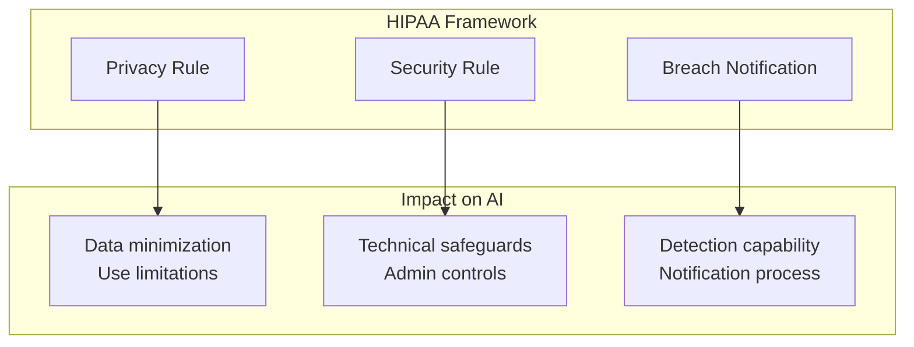
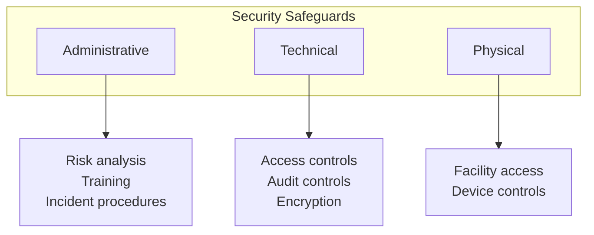
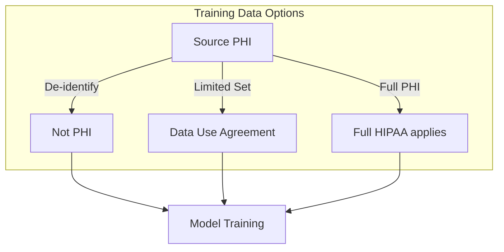
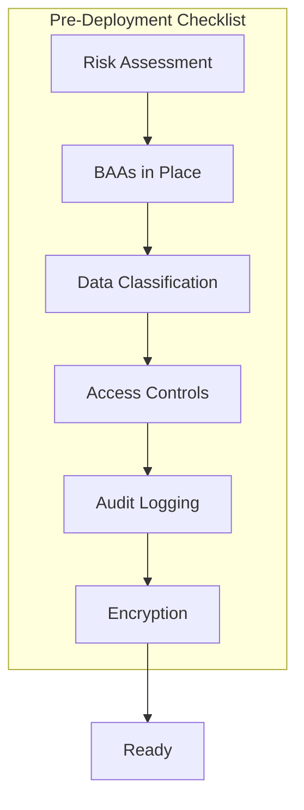
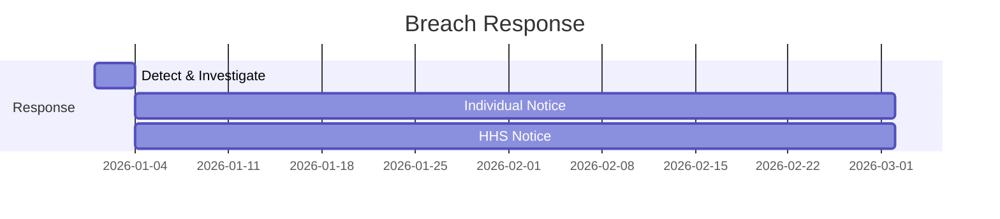

# HIPAA-Compliant AI: A Practical Guide

## Deploying AI in healthcare requires navigating HIPAA's complex requirements. Here's what you need to know—from BAAs to breach protocols.

AI in healthcare promises better diagnoses, personalized treatment, and operational efficiency. HIPAA compliance promises lawyers, audits, and potential penalties.

You need both.

This guide covers the practical reality of deploying AI systems that handle Protected Health Information (PHI).

---

## HIPAA Fundamentals for AI

### What HIPAA Protects

| Category | Examples |
|----------|----------|
| Identifiers | Name, SSN, phone, email |
| Medical | Diagnoses, treatments, results |
| Financial | Payment, insurance data |
| Derived | **AI predictions based on PHI** |

> "Critical point: AI predictions derived from PHI are themselves PHI and subject to HIPAA requirements."

---

## Security Safeguards for AI Systems

### Technical Safeguards for AI

**Access Controls:**
- Who can query the model?
- Who can access training data?
- Who can modify the model?
- How are API keys managed?

**Audit Controls:**
- Log all inference requests with user context
- Track model versions and deployments
- Record training data access

**Transmission Security:**
- Encrypt API calls to/from AI systems
- Secure model deployment pipelines
- Protected data transfer for training

---

## AI-Specific HIPAA Challenges

### Challenge 1: Training Data

### Challenge 2: Model Memorization

AI models can memorize and leak training data through:
- Model inversion attacks
- Membership inference
- Overfitting

**Mitigations:** Differential privacy, regularization, output filtering, regular audits.

### Challenge 3: Third-Party AI

| Provider | BAA Available | HIPAA Eligible |
|----------|---------------|----------------|
| AWS | Yes | Yes (specific services) |
| Google Cloud | Yes | Yes (specific services) |
| Azure | Yes | Yes (specific services) |
| OpenAI | Limited | Via Azure only |

> "Warning: Consumer AI services (ChatGPT, Gemini) are NOT HIPAA-compliant. Never paste PHI."

---

## Implementation Checklist

### Pre-Deployment

**Required:**
- [ ] Risk assessment for AI system
- [ ] BAAs signed with all parties
- [ ] Data inventory documenting all PHI
- [ ] Minimum necessary standard applied
- [ ] Encryption at rest and in transit
- [ ] Audit logging for all access
- [ ] Incident response procedures
- [ ] Training for all staff

---

## Breach Response

### What Constitutes a Breach?

- Training data exposed
- Model reveals PHI through inference
- Unauthorized API access
- Model theft with embedded PHI patterns

### Response Timeline

**Requirements:**
- Notify affected individuals within 60 days
- Notify HHS (timing depends on size)
- Notify media if 500+ in a state
- Document everything

---

## The Bottom Line

HIPAA-compliant AI is achievable but requires:

1. **Understanding** that AI outputs from PHI are PHI
2. **Planning** compliance into architecture from day one
3. **Documenting** all data flows, access, and decisions
4. **Monitoring** continuously for compliance and breaches
5. **Training** everyone who touches the system

> "The investment in compliance is significant. The cost of non-compliance—fines up to $1.9 million per violation category per year—is higher."

---

*ServiceVision has a 100% compliance record across 20+ years of healthcare technology work. We build HIPAA compliance into AI systems from architecture through deployment.*

---

**Tags:** HIPAA Compliance, Healthcare AI, PHI Protection, Medical AI, Healthcare Technology, AI Compliance, Data Privacy, Healthcare Security, Regulatory Compliance, Health Information
