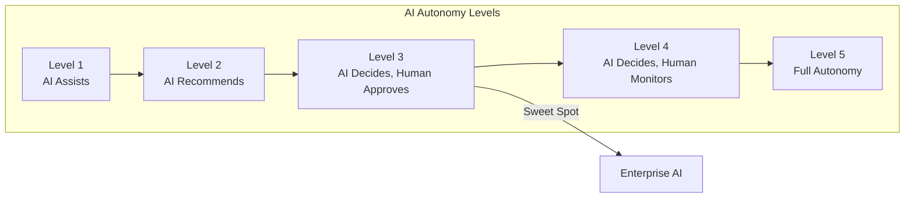
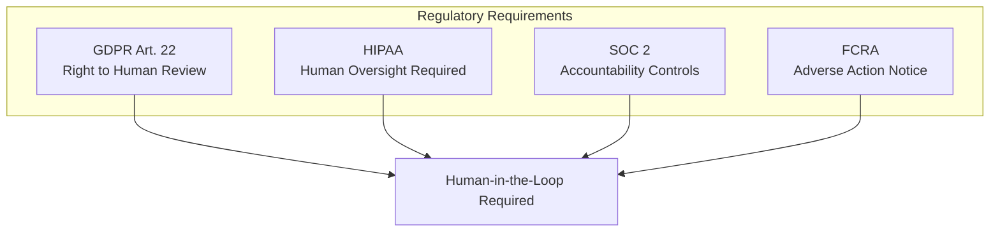
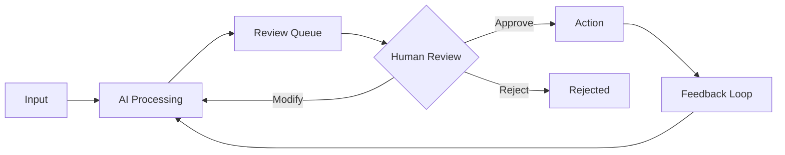
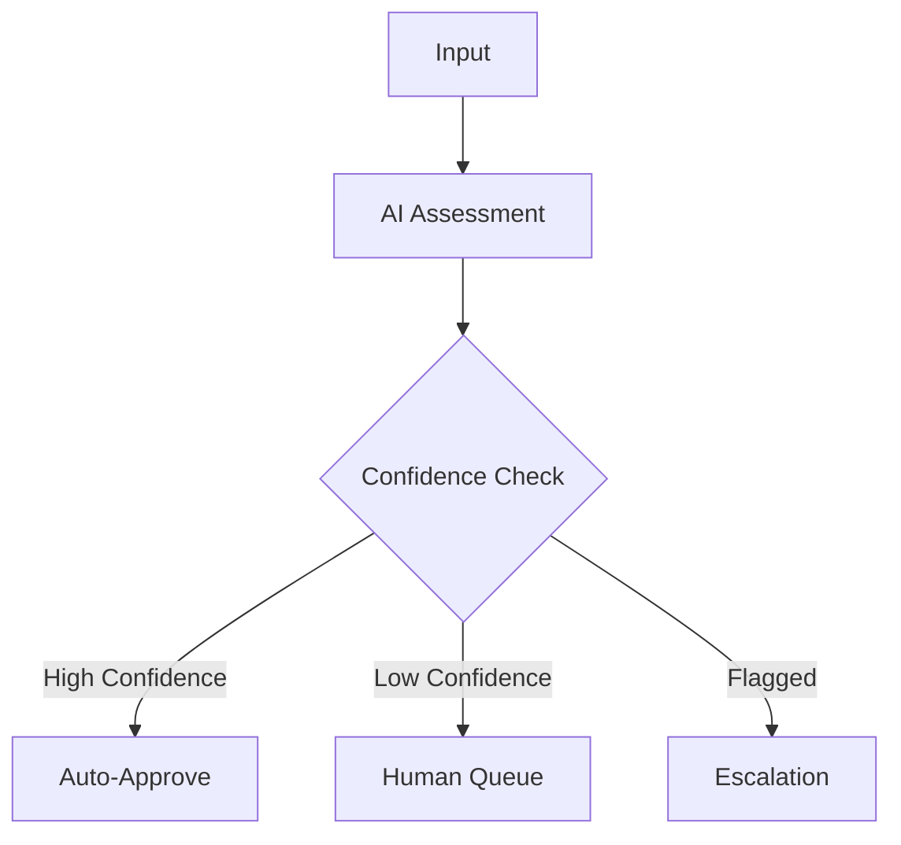

# Human-in-the-Loop AI: Why the Best Systems Keep Humans in Control

## AI that removes humans from decisions isn't smarter—it's riskier. Here's how to design AI systems that augment human judgment instead of replacing it.

The sales pitch is seductive: "Fully autonomous AI. No human intervention required. Set it and forget it."

It's also a recipe for disaster in regulated industries, high-stakes decisions, and any environment where mistakes have real consequences.

The most effective enterprise AI systems don't remove humans—they augment them.

---

## The Autonomy Spectrum

Most enterprise AI should operate at **Level 3**: AI makes decisions, humans approve. This balances efficiency with accountability.

Level 5 autonomy sounds efficient, but it's appropriate for a narrow set of use cases—and almost never in regulated environments.

---

## Why Human-in-the-Loop Matters

### Regulatory Compliance

GDPR Article 22 gives individuals the right not to be subject to decisions based solely on automated processing. HIPAA requires human oversight for medical decisions. SOC 2 demands accountability for system actions.

> "Full autonomy isn't just risky—in many cases, it's illegal."

### Model Drift and Degradation

AI models degrade over time. The world changes; the model doesn't. Without human oversight, you won't catch the drift until something breaks badly.

### Edge Cases and Exceptions

AI excels at patterns. Humans excel at exceptions. The customer who doesn't fit any category. The transaction that's unusual but legitimate.

### Accountability and Trust

When something goes wrong, someone needs to be accountable. "The AI did it" isn't an acceptable answer to customers, regulators, or courts.

---

## Designing Human-in-the-Loop Systems

### The Review Queue Pattern

AI processes inputs and generates recommendations. Humans review and approve before action is taken.

**When to use:** High-stakes decisions, regulated processes, customer-facing actions.

### The Exception Handler Pattern

AI handles routine cases autonomously. Exceptions route to humans.

**When to use:** High-volume processes with clear routine cases and identifiable exceptions.

### The Audit and Override Pattern

AI acts autonomously, but all decisions are logged and humans can review and override.

**When to use:** Lower-stakes decisions where speed matters but reversibility is possible.

---

## Implementation Best Practices

### 1. Design for the Reviewer's Experience

If review is painful, it won't happen properly. Design review interfaces that surface the right information, enable quick decisions, and minimize cognitive load.

### 2. Set Realistic Throughput Expectations

If your AI generates 10,000 recommendations per hour and you have three reviewers, the math doesn't work.

### 3. Build Feedback Loops

Every human decision is training data. Capture approvals, rejections, modifications, and the reasons behind them.

### 4. Monitor Reviewer Quality

Humans make mistakes too. Monitor approval rates, reversal rates, and consistency across reviewers.

### 5. Plan for Reviewer Unavailability

What happens at 2 AM? On holidays? Design fallback procedures and escalation paths.

---

## The Efficiency Argument

"But human review slows everything down!"

Yes. That's often the point. Some decisions shouldn't be instant.

| Process | Manual Time | AI + Human Review |
|---------|-------------|-------------------|
| Invoice Processing | 15 min | 2 min review |
| Loan Decision | 3 days | 4 hours |
| Fraud Detection | Reactive | Real-time flag, 5 min review |

> "The goal isn't full automation. It's appropriate automation with human judgment where it matters."

---

## The Bottom Line

The best AI systems aren't the most autonomous. They're the ones that combine AI efficiency with human judgment.

Design for human-in-the-loop from the start. It's easier to remove human review later than to add it when regulators come calling.

---

*ServiceVision builds AI systems with human oversight designed in from the architecture phase. Our compliance-first approach has maintained a 100% compliance record across 20+ years.*

---

**Tags:** Human-in-the-Loop, AI Governance, Enterprise AI, AI Compliance, Machine Learning, Responsible AI, AI Architecture, Human Oversight, AI Ethics, Regulatory Compliance
