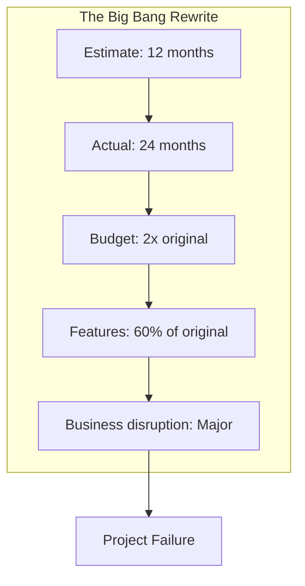
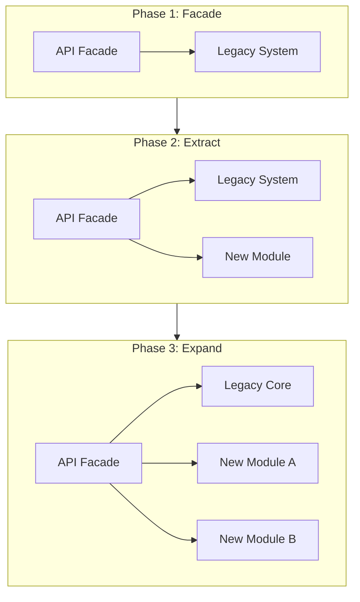
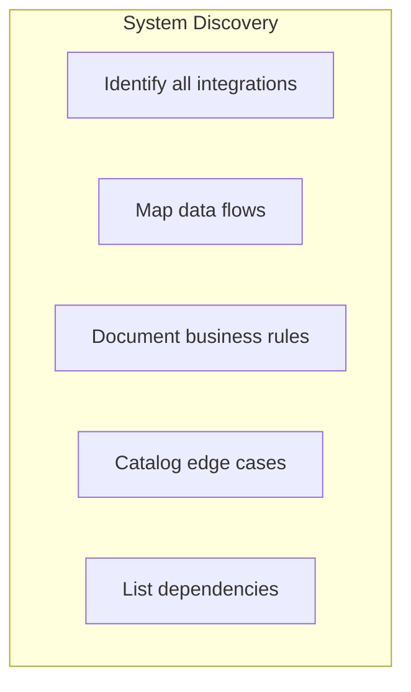
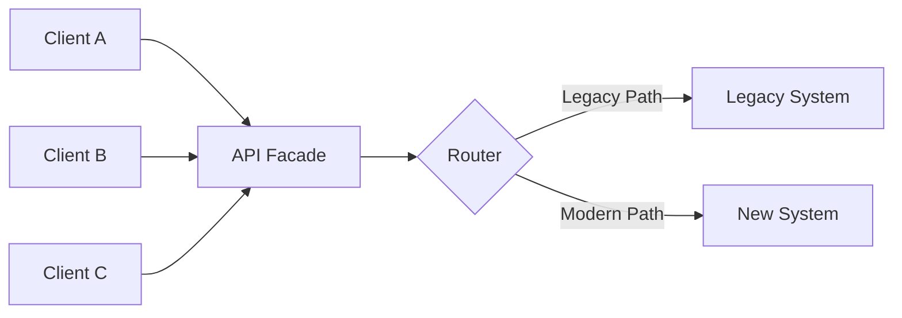
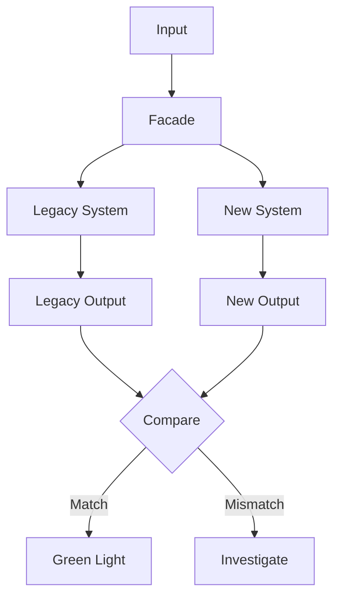

# Legacy System Modernization Without the Rewrite

## You don't have to rebuild everything from scratch. The strangler fig pattern lets you modernize legacy systems incrementally—without the risk of big-bang rewrites.

Every established company has them: the systems that run the business but haven't been touched in years. The COBOL mainframe. The VB6 application. The Access database that somehow became mission-critical.

The conventional wisdom says: rewrite it. Start fresh. Build it right this time.

That's a trap.

---

## The Rewrite Trap

The statistics on major system rewrites are brutal:

- **70%** of large-scale rewrites fail or are significantly delayed
- Average cost overrun: **189%**
- Average schedule overrun: **222%**
- Feature parity at launch: rarely achieved

> "Legacy systems embody years of accumulated business logic, edge cases, and institutional knowledge. It's not documented. It's in the code."

---

## The Strangler Fig Pattern

Instead of replacing the legacy system all at once, gradually grow a new system around it—like a strangler fig tree growing around its host.

### How It Works

1. **Facade First**: Put an API layer in front of the legacy system
2. **Extract Incrementally**: Pull functionality out one piece at a time
3. **Verify Continuously**: Run old and new systems in parallel
4. **Strangle Gradually**: As more moves to new systems, legacy handles less

---

## Real-World Implementation

### Step 1: Map the Territory

Before touching code, understand what you have:

### Step 2: Build the Facade

The facade is your control point. Everything goes through it.

### Step 3: Extract by Business Capability

**Wrong approach**: "Let's modernize the database first, then the business logic, then the UI."

**Right approach**: "Let's modernize the invoice processing capability end-to-end."

### Step 4: Parallel Running

Before cutting over, run both systems simultaneously:

### Step 5: Incremental Cutover

1. **Shadow mode**: New system runs but results aren't used
2. **Canary**: 5% of traffic goes to new system
3. **Gradual rollout**: Increase percentage as confidence grows
4. **Full cutover**: All traffic to new system
5. **Legacy sunset**: Old system decommissioned

---

## Common Pitfalls

### Pitfall 1: Modernizing Everything at Once

"While we're in there, let's also..." No. Resist scope creep.

### Pitfall 2: Ignoring the Data

The hardest part is usually the data. Plan for significant data cleaning and transformation work.

### Pitfall 3: Losing Institutional Knowledge

The people who built the legacy system may be gone. Capture their knowledge before they leave.

### Pitfall 4: Underestimating Testing

Legacy systems often lack tests. Build a test harness around what exists before modernizing.

---

## The Bottom Line

You don't have to bet the company on a multi-year rewrite. The strangler fig pattern lets you:

- Modernize incrementally
- Deliver value continuously
- Manage risk carefully
- Learn as you go

> "The legacy system didn't get built in a day. It doesn't have to be replaced in a day either."

---

*ServiceVision has modernized legacy systems across financial services, healthcare, and government sectors. We specialize in low-risk, incremental transformation that keeps the business running while technology evolves.*

---

**Tags:** Legacy Modernization, Strangler Fig Pattern, System Migration, Technical Debt, Software Architecture, Digital Transformation, Enterprise Technology, System Integration, Incremental Development, Technology Strategy
