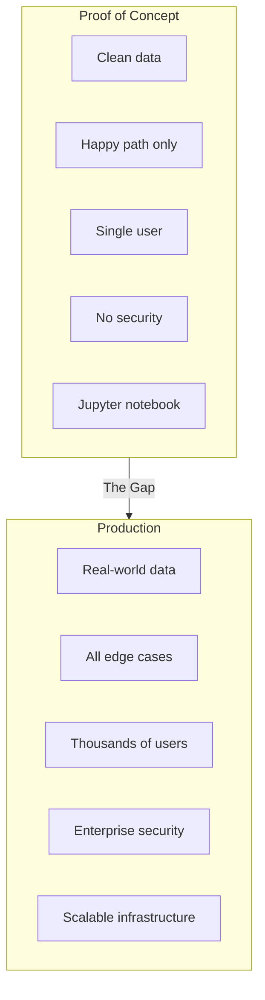
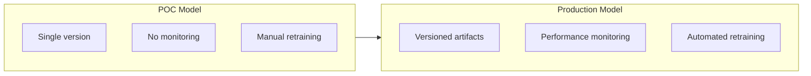
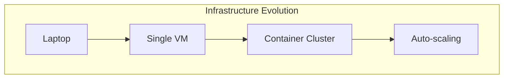
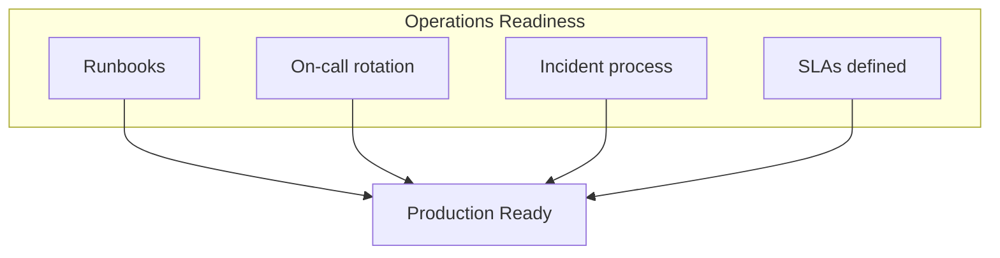
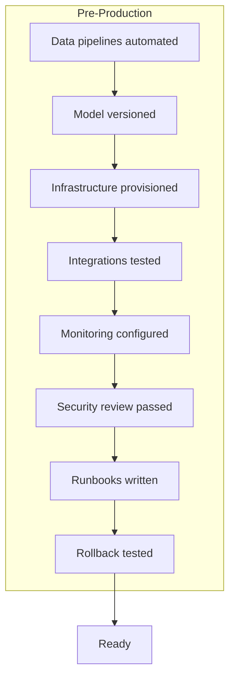
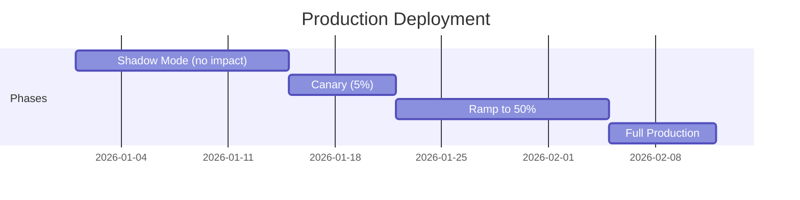
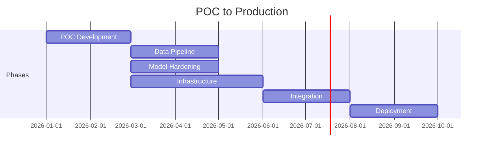

# From Proof of Concept to Production: Enterprise AI Deployment

## Your AI proof of concept works. Now what? The path from POC to production is where most enterprise AI projects die. Here's how to survive it.

The demo went great. The model predicts accurately. Leadership is excited.

"Let's deploy it to production!"

Six months later, you're still "almost ready." The POC that worked perfectly is stuck in what we call "pilot purgatory"—too good to kill, too incomplete to deploy.

This is where most enterprise AI projects die. Here's how to survive.

---

## The POC-Production Gap

> "The gap between POC and production is not incremental. It's a category change. Everything that made the POC fast becomes a liability in production."

---

## The Production Readiness Framework

### Stage 1: Data Production-Readiness

| Requirement | POC Approach | Production Approach |
|-------------|--------------|---------------------|
| Data quality | Manual cleaning | Automated validation |
| Data freshness | Static snapshot | Real-time pipelines |
| Schema changes | Ignore | Handle gracefully |
| Missing values | Exclude | Impute or flag |
| Data lineage | Unknown | Fully tracked |

### Stage 2: Model Production-Readiness

**Requirements:** Versioning, packaging, serving SLAs, monitoring, automated retraining, instant rollback.

### Stage 3: Infrastructure Production-Readiness

**Requirements:** Right-sized compute, CI/CD, Kubernetes or ML platforms, observability.

### Stage 4: Integration Production-Readiness

POC stood alone. Production connects to everything—APIs, event streaming, database sync, workflows.

### Stage 5: Operations Production-Readiness

### Stage 6: Compliance Production-Readiness

Security review, access controls, audit logging, data privacy verification, regulatory requirements.

---

## The Deployment Checklist

---

## Deployment Strategy

Don't flip a switch. Deploy gradually.

**Phases:**
1. **Shadow Mode**: Run, compare outputs, no action
2. **Canary**: 5% traffic, real impact, close monitoring
3. **Gradual Ramp**: Increase as confidence grows
4. **Full Production**: All traffic, normal operations

---

## Common Pitfalls

### Pitfall 1: Underestimating the Gap

"The POC is 80% done." No. Production is often 10x the POC effort.

### Pitfall 2: Skipping Shadow Mode

Shadow mode catches problems testing doesn't—real data, real scale, real integrations.

### Pitfall 3: No Rollback Plan

Always have one. Test it. Document it. Practice it.

### Pitfall 4: Declaring Victory Too Early

The first week of production is the beginning, not the end.

### Pitfall 5: Forgetting Maintenance

AI systems need ongoing care. Budget for it.

---

## Realistic Timeline

> "Total: 12-18 months from POC start to stable production. This isn't slow—it's realistic for enterprise AI."

---

## The Bottom Line

The POC is proof that AI can work. Production is proof that it works reliably, at scale, within constraints, day after day.

Plan for the full journey. Budget for productionization. Deploy gradually. Monitor intensely. And have a rollback plan.

---

*ServiceVision specializes in taking AI from proof of concept to production. We've done it across healthcare, finance, and government—with a 100% compliance record.*

---

**Tags:** AI Deployment, MLOps, Production AI, Enterprise AI, POC to Production, Machine Learning, AI Infrastructure, Model Deployment, AI Operations, AI Implementation
