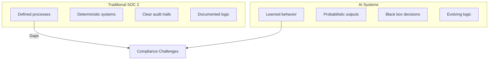
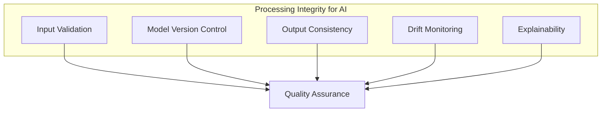
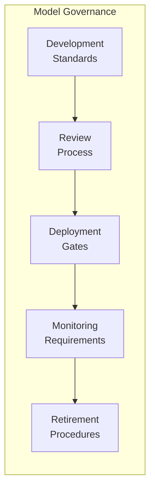
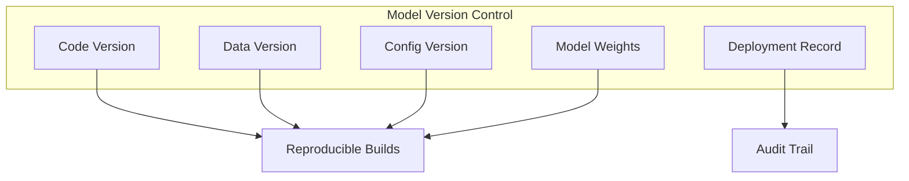
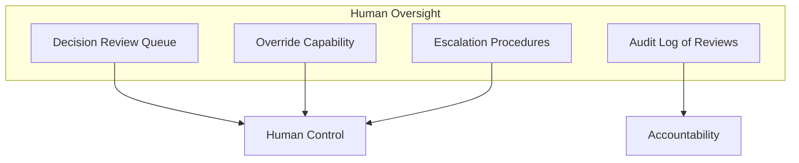

# SOC 2 Compliance in the Age of AI

## AI systems introduce new compliance challenges that traditional SOC 2 frameworks weren't designed for. Here's how to maintain compliance while deploying AI.

Your organization achieved SOC 2 compliance. Your controls are documented. Your audits pass.

Then you deploy AI systems—and suddenly, auditors are asking questions you can't answer.

"How do you ensure the AI's decisions are consistent?"
"Where's the audit trail for model changes?"
"How do you know the training data didn't include prohibited information?"

SOC 2 wasn't designed for AI. But your auditors expect compliance anyway.

---

## The AI Compliance Gap

> "Traditional software does what it's programmed to do. Every time. AI systems learn from data, make probabilistic decisions, and change over time."

---

## SOC 2 Trust Service Criteria and AI

### Security

**AI-specific concerns:**
- Model weights as intellectual property
- Training data sensitivity
- Adversarial attack protection
- Inference endpoint security

### Availability

**AI complications:**
- Model inference scaling
- GPU/TPU resource constraints
- Model degradation affecting availability
- Retraining causing downtime

### Processing Integrity

**Key controls:**
- Input validation and sanitization
- Model versioning and rollback
- Accuracy monitoring and thresholds
- Explainability documentation

### Confidentiality

**AI risks:**
- Training data containing confidential info
- Models memorizing and leaking data
- Model inversion attacks

### Privacy

**AI complications:**
- Personal information in training data
- AI inferring PII from non-PII
- Automated decision-making implications

---

## Building Compliant AI Systems

### Control 1: Model Governance Framework

### Control 2: Training Data Management

| Data Element | Required Documentation |
|--------------|------------------------|
| Data source | Origin, collection method, legal basis |
| Data content | Fields, sensitivity classification |
| Data quality | Validation procedures, quality metrics |
| Data retention | Retention period, deletion procedures |
| Data access | Who can access, for what purpose |

### Control 3: Model Versioning and Audit Trail

### Control 4: Monitoring and Alerting

**Monitor:** Inference latency, error rates, accuracy metrics, input/output distribution shifts.

**Alert on:** Accuracy below threshold, significant drift, unusual patterns, resource exhaustion.

### Control 5: Human Oversight and Override

---

## Common Auditor Questions

| Question | What They're Looking For |
|----------|--------------------------|
| How do you know the model is accurate? | Monitoring, metrics, thresholds |
| How do you prevent unauthorized changes? | Access controls, approval workflows |
| Can you reproduce a past decision? | Versioning, logging, explainability |
| How do you protect training data? | Classification, encryption, access |
| What happens if the model fails? | Failover, rollback, incident response |

---

## The Bottom Line

SOC 2 compliance for AI systems requires extending traditional controls to address new risks:

- Probabilistic behavior instead of deterministic
- Learning systems instead of programmed systems
- Data-dependent behavior instead of code-only
- Black box decisions instead of transparent logic

> "Build these controls into your AI development process from the start. Retrofitting compliance is painful and often incomplete."

---

*ServiceVision has maintained a 100% compliance record across 20+ years, including AI system deployments in regulated industries. We build compliance into AI architecture from day one.*

---

**Tags:** SOC 2 Compliance, AI Compliance, Enterprise Security, AI Governance, Model Governance, Audit, Regulatory Compliance, AI Security, Trust Service Criteria, Machine Learning Compliance
