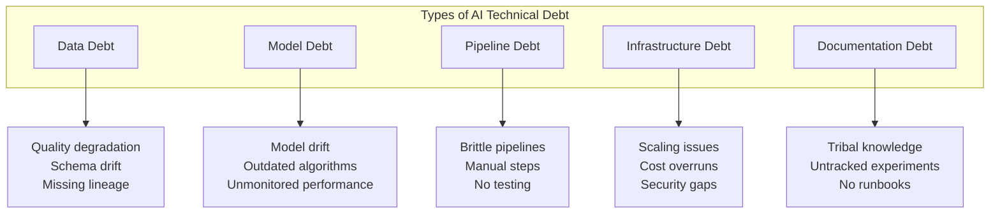
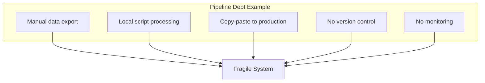
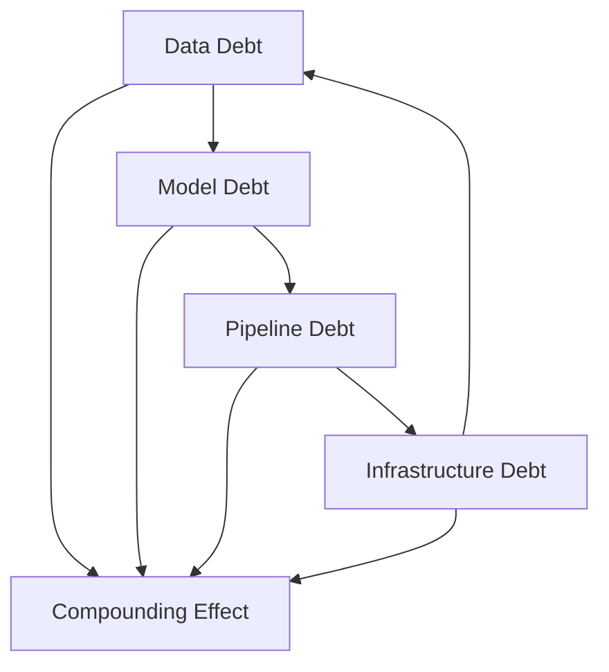
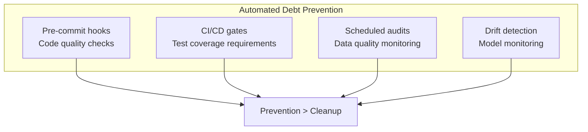

# The True Cost of AI Technical Debt

## AI systems accumulate technical debt faster than traditional software. Here's what that debt looks like and how to manage it before it bankrupts your AI initiative.

You've deployed your AI system. It works. The stakeholders are happy.

Six months later, you're drowning in production issues, model accuracy has degraded, and your data scientists are spending 80% of their time on maintenance instead of new features.

Welcome to AI technical debt—and it compounds faster than any debt you've encountered in traditional software.

---

## AI Debt: A Taxonomy

### Data Debt

The most insidious form. Your model is only as good as your data—and data quality erodes constantly.

**How it accumulates:** Source schemas change, no data lineage, training and production data diverge.

**The cost:** Silent accuracy degradation, compliance nightmares, debugging takes days.

### Model Debt

Models age. The world changes. Algorithms improve. But your production model sits frozen.

**How it accumulates:** No scheduled retraining, no drift detection, better algorithms not evaluated.

**The cost:** Performance declines invisibly, competitors surpass you, eventual dramatic failure.

### Pipeline Debt

The code that moves data and runs models gets the least attention—and creates the most problems.

---

## The Compound Effect

AI technical debt compounds exponentially because of dependencies:

> "Data quality issues cause model degradation. Model instability strains pipelines. Pipeline failures demand infrastructure changes. Each type of debt makes the others worse."

---

## Measuring AI Technical Debt

| Metric | Healthy | Warning | Critical |
|--------|---------|---------|----------|
| Model freshness | < 30 days | 30-90 days | > 90 days |
| Data quality score | > 95% | 85-95% | < 85% |
| Pipeline success rate | > 99% | 95-99% | < 95% |
| Deployment frequency | Weekly+ | Monthly | Quarterly+ |
| Mean time to recovery | < 1 hour | 1-4 hours | > 4 hours |
| Documentation coverage | > 80% | 50-80% | < 50% |

---

## Paying Down the Debt

### Strategy 1: The 20% Rule

Allocate 20% of AI team capacity to debt reduction. Every sprint, every month—consistently.

### Strategy 2: Debt Sprints

Periodically, dedicate full sprints to debt reduction. Especially effective after major releases.

### Strategy 3: Automated Enforcement

### Strategy 4: Systematic Documentation

Treat documentation as a first-class deliverable—model cards, experiment tracking, runbooks.

---

## The ROI of Debt Reduction

| Without Debt Reduction | With Debt Reduction |
|------------------------|---------------------|
| 70% time on maintenance | 40% time on maintenance |
| Monthly incidents | Quarterly incidents |
| 2-week debugging cycles | 2-day debugging cycles |
| Key-person dependency | Team resilience |

> "The compound effect works both ways. Reducing debt creates a virtuous cycle of faster development and fewer problems."

---

## The Bottom Line

AI technical debt is inevitable. What's not inevitable is letting it become unmanageable.

Track your debt. Allocate time to reduce it. Build systems that prevent it.

The companies succeeding with AI aren't the ones building the most models. They're the ones maintaining healthy systems over time.

---

*ServiceVision helps established companies build AI systems designed for maintainability from day one. Our MLOps expertise ensures your AI investment pays off over years, not just months.*

---

**Tags:** AI Technical Debt, MLOps, Machine Learning Operations, Data Quality, Model Maintenance, AI Infrastructure, Technical Debt, AI Operations, ML Pipeline, AI Maintenance
