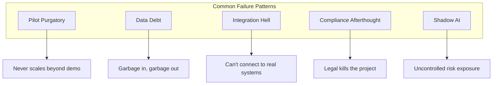
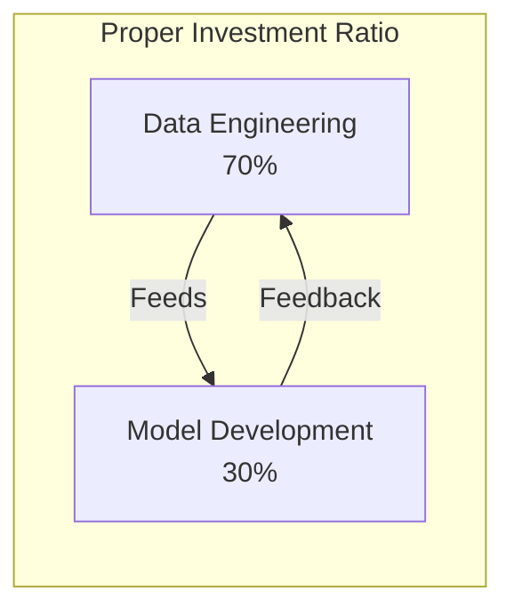
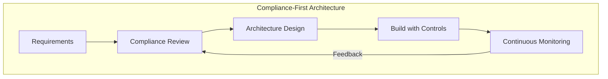
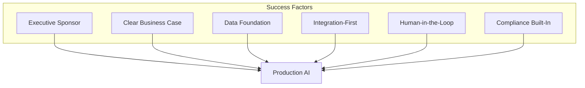
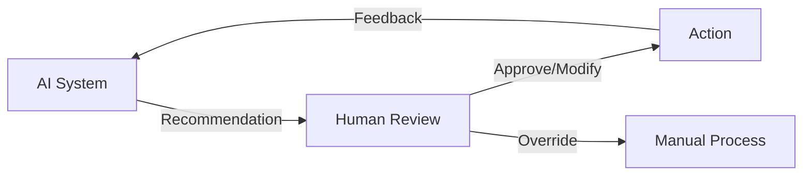

# Why Enterprise AI Projects Fail (And How to Prevent It)

## 80% of enterprise AI initiatives fail to reach production. Here's what separates the 20% that succeed—and it's not the technology.

The statistics are sobering: 80% of enterprise AI projects never make it to production. Billions invested, thousands of proofs-of-concept built, and most of them sit gathering digital dust.

After 20+ years of building technology for enterprises, we've seen the patterns. The failures aren't random. They're predictable—and preventable.

---

## The Anatomy of AI Project Failure

The common failure patterns in enterprise AI:

### Pattern 1: Pilot Purgatory

The demo works. Leadership is impressed. Then it sits in pilot mode for 18 months.

**Why it happens:** The team optimized for the presentation, not for production. They used clean sample data, bypassed security requirements, and ignored edge cases.

**How to prevent it:** Define production requirements from day one. Every pilot should include a documented path to deployment with specific milestones.

### Pattern 2: Data Debt

The model performs brilliantly on test data. In production, it produces nonsense.

**Why it happens:** Test data was curated. Production data is messy, incomplete, and constantly changing. Nobody planned for data pipelines, validation, or ongoing quality monitoring.

**How to prevent it:** Invest in data infrastructure before model development. The ratio should be 70% data engineering, 30% model work.

### Pattern 3: Integration Hell

The AI works in isolation. But it needs to connect to SAP, Salesforce, legacy mainframes, and three different databases. Six months later, the integration is still "almost done."

**How to prevent it:** Start with integration architecture. Build the connections first, then add the AI. Not the reverse.

### Pattern 4: Compliance as Afterthought

The project is ready to deploy. Then legal reviews it.

> "Where's the audit trail? How do we explain this decision to regulators? Who approved the training data?"

Project shelved indefinitely.

**How to prevent it:** Include compliance from the architecture phase. Build explainability, audit logging, and governance into the foundation.

### Pattern 5: Shadow AI

While IT debates the enterprise AI strategy, departments deploy their own solutions. Marketing uses one chatbot. Sales uses another. Finance has a spreadsheet with GPT macros.

**How to prevent it:** Provide sanctioned alternatives quickly. Create an AI governance framework that enables rather than blocks.

---

## The 20% That Succeed

Successful enterprise AI projects share common characteristics:

### 1. Executive Sponsorship with Budget Authority

Not just endorsement—actual authority to allocate resources and remove obstacles.

### 2. Clear Business Case with Measurable Outcomes

"Improve efficiency" isn't a business case. "Reduce manual invoice processing from 4 hours to 20 minutes, saving $2.3M annually" is a business case.

### 3. Data Foundation Before AI

The organizations succeeding with AI invested in data quality, data governance, and data engineering years before the AI hype.

### 4. Integration-First Architecture

Successful projects start with the question: "How will this connect to our existing systems?"

### 5. Human-in-the-Loop Design

Every successful enterprise AI system we've seen includes human oversight. Not because AI can't automate—but because businesses need accountability, explainability, and the ability to course-correct.

### 6. Compliance Built into Architecture

Security, privacy, audit trails, and explainability aren't features to add later. They're architectural requirements from day one.

---

## The Hard Truth

Most AI project failures aren't technical failures. They're organizational failures. The technology works. The implementation doesn't.

Success requires:
- Realistic expectations
- Proper investment in data
- Integration planning
- Compliance involvement
- Human oversight
- Executive commitment

> "The 20% that succeed aren't using better AI. They're using better process."

---

*ServiceVision helps established companies implement AI that actually reaches production. We bring 20+ years of enterprise experience and a 100% compliance record to every engagement.*

---

**Tags:** Enterprise AI, AI Implementation, Digital Transformation, AI Strategy, Machine Learning, AI Compliance, Data Engineering, AI Governance, Technology Leadership, MLOps
