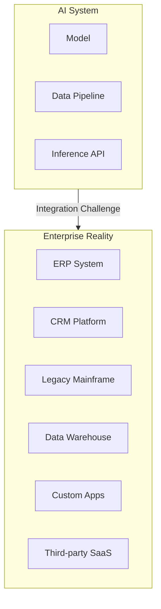
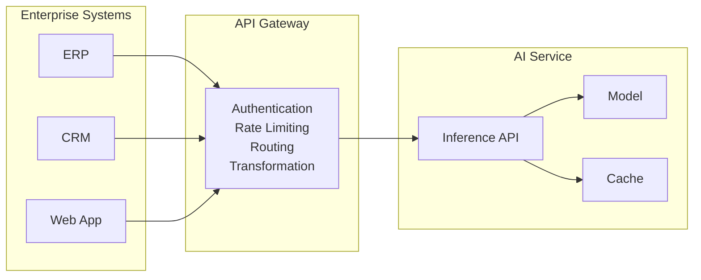
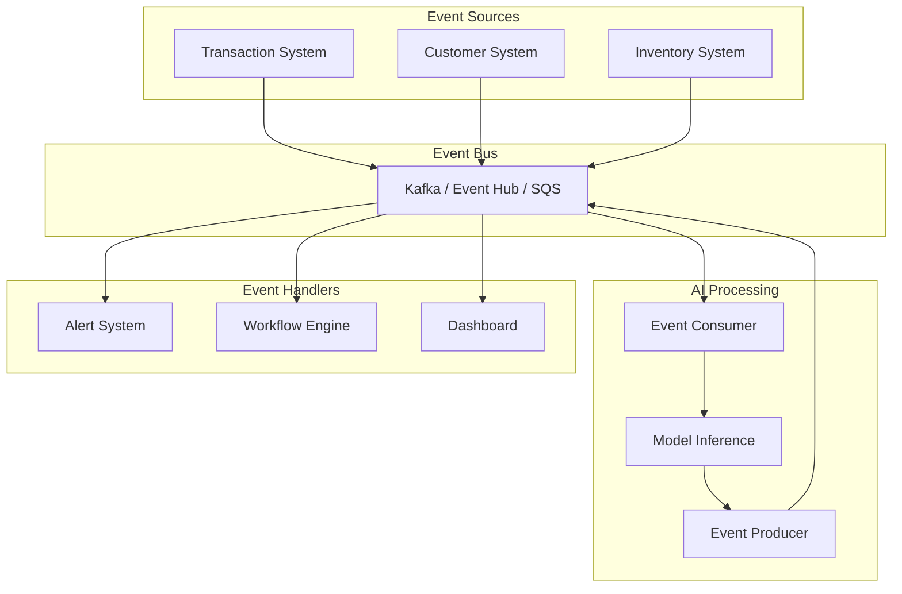
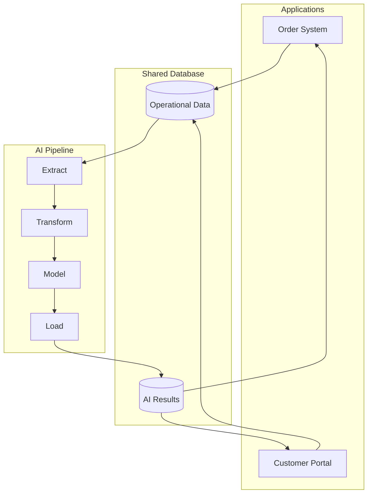
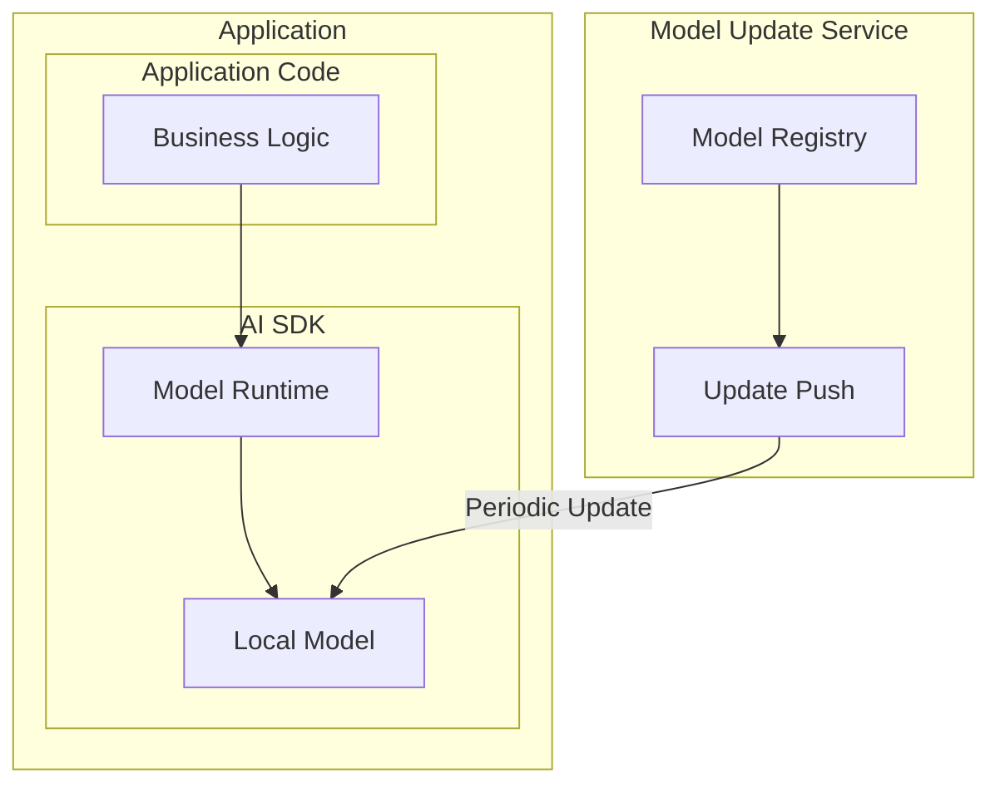
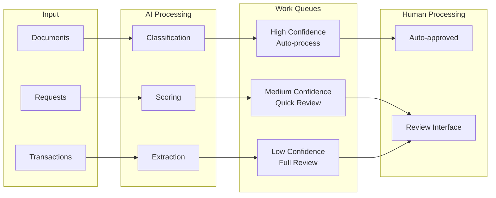
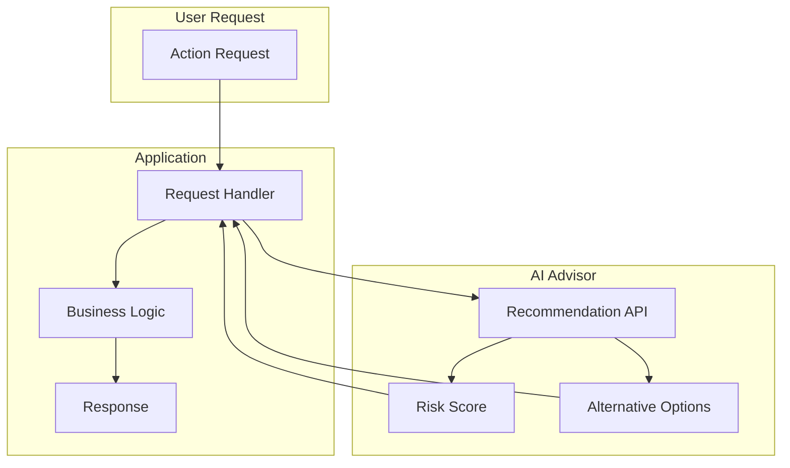
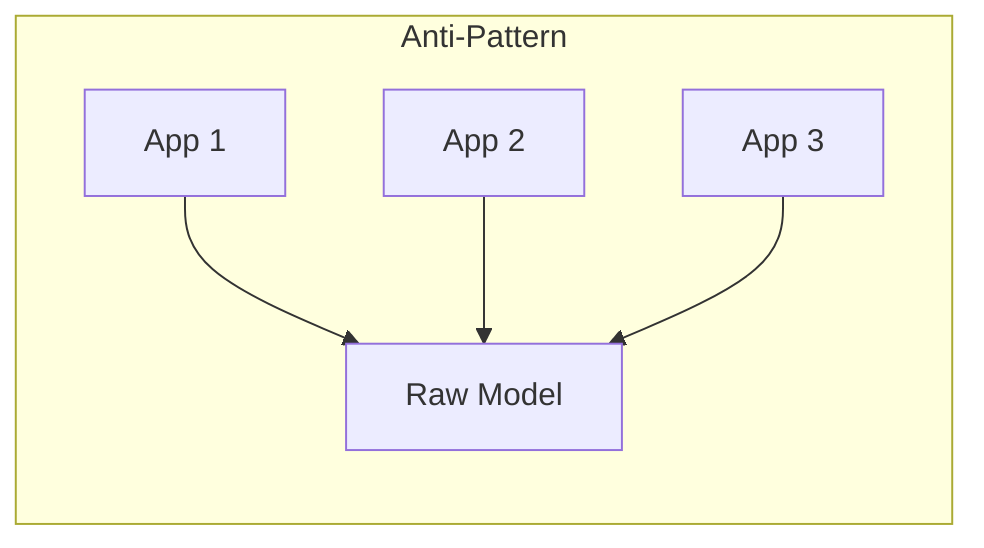
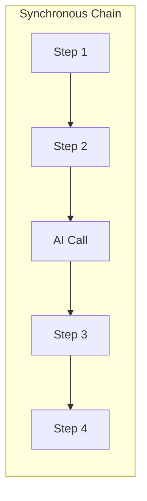

# AI Integration Patterns for Enterprise Systems

Building AI is one challenge. Integrating it into decades of existing enterprise systems is another entirely.

The AI works perfectly in the lab. Then it meets SAP, Salesforce, a mainframe from 1987, three middleware platforms, and a security architecture that doesn't trust anything new.

Here are the patterns that actually work.

## The Integration Challenge

Enterprise systems have:
- Multiple data formats and protocols
- Complex security requirements
- Change management processes
- Performance expectations
- Availability requirements
- Decades of accumulated customization

AI systems need:
- Real-time or batch data access
- Low-latency inference
- Feedback loops for improvement
- Monitoring and observability
- Graceful degradation

Bridging these worlds requires careful architecture.

## Pattern 1: API Gateway Integration

Put the AI behind a standard API that looks like any other enterprise service.

**When to use:**
- AI provides discrete predictions/classifications
- Multiple systems need AI capability
- Standard request/response pattern works

**Implementation notes:**
- Use standard API formats (REST, gRPC)
- Implement proper authentication (OAuth, API keys)
- Add rate limiting to protect the model
- Consider caching for repeated inputs
- Build fallback responses for model failures

**Anti-pattern:** Exposing the raw model endpoint without a service layer. Models change; APIs should be stable.

## Pattern 2: Event-Driven Integration

AI reacts to events in the enterprise event stream.

**When to use:**
- AI processes streams of events
- Results feed into workflows or alerts
- Loose coupling is desired
- Eventual consistency is acceptable

**Implementation notes:**
- Design for idempotency (events may replay)
- Handle out-of-order delivery
- Implement dead letter queues for failures
- Monitor consumer lag
- Plan for schema evolution

**Anti-pattern:** Tight coupling where AI results must be synchronously processed. Event systems are eventually consistent.

## Pattern 3: Database Integration

AI reads from and writes to shared databases.

**When to use:**
- Batch processing is acceptable
- Applications already use shared databases
- AI augments existing data with predictions

**Implementation notes:**
- Use separate tables/schemas for AI outputs
- Document data freshness SLAs
- Implement change data capture for triggers
- Monitor database performance impact
- Consider materialized views for complex queries

**Anti-pattern:** AI directly modifying operational tables. Keep AI outputs separate and explicit.

## Pattern 4: Embedded AI

AI runs inside the application, not as a separate service.

**When to use:**
- Ultra-low latency required
- Network round-trips unacceptable
- Model is small enough to embed
- Offline operation needed

**Implementation notes:**
- Design for model updates without app restarts
- Implement local caching and fallbacks
- Monitor model versions across deployments
- Consider ONNX or similar portable formats
- Test memory and CPU impact

**Anti-pattern:** Embedding large models that should be centralized. Balance latency against resource usage.

## Pattern 5: Human-in-the-Loop Queue

AI feeds a work queue for human review and action.

**When to use:**
- Decisions require human oversight
- AI confidence varies
- Regulatory requirements mandate review
- Training data needs to be collected

**Implementation notes:**
- Design efficient review interfaces
- Capture human decisions for model improvement
- Balance automation rate against error rate
- Monitor queue depths and processing times
- Implement SLAs and escalation

**Anti-pattern:** All-or-nothing automation. Graduated confidence thresholds maximize throughput while maintaining quality.

## Pattern 6: Sidecar/Advisor Pattern

AI provides recommendations that applications can use or ignore.

**When to use:**
- AI augments but doesn't control decisions
- Gradual AI adoption desired
- Application needs to maintain control
- Fallback to non-AI flow required

**Implementation notes:**
- Design for optional AI input
- Don't block if AI is unavailable
- Log when AI advice is followed vs. ignored
- Track outcomes to measure AI value
- Make AI influence visible and explainable

**Anti-pattern:** Making AI mandatory before it's proven. Start optional, prove value, then increase influence.

## Anti-Patterns to Avoid

### 1. Direct Model Access

Exposing models directly to applications without a service layer.

**Problems:** Model changes break all consumers; no versioning; no monitoring; no security.

### 2. Big Bang Integration

Trying to integrate AI everywhere at once.

**Problems:** Too much change; can't isolate failures; no learning; overwhelming complexity.

### 3. Ignoring Failure Modes

Assuming AI will always be available and correct.

**Problems:** Cascading failures; no graceful degradation; poor user experience.

### 4. Synchronous Chains

Long synchronous chains where AI is in the critical path.

**Problems:** AI latency affects entire chain; single point of failure; hard to scale.

## Integration Checklist

Before integrating AI into enterprise systems:

| Consideration | Questions |
|---------------|-----------|
| Data flow | Where does input data come from? Where do results go? |
| Latency | What response time is required? Acceptable? |
| Availability | What happens when AI is unavailable? |
| Security | How is AI access controlled? Data protected? |
| Monitoring | How will you know if AI is working correctly? |
| Versioning | How will model updates be handled? |
| Rollback | Can you revert to previous behavior? |
| Compliance | What audit trail is required? |

## The Bottom Line

AI integration is an architecture problem, not just an AI problem. The patterns that work:

1. **Loose coupling** through APIs and events
2. **Graceful degradation** when AI fails
3. **Human oversight** for critical decisions
4. **Incremental adoption** to reduce risk
5. **Proper monitoring** for AI-specific concerns

Build the integration architecture before optimizing the model. The best model in the world is useless if it can't connect to your systems.

---

*ServiceVision specializes in integrating AI into existing enterprise architectures. We understand both the AI and the enterprise—and how to connect them. [Let's discuss your integration challenges](/contact).*
