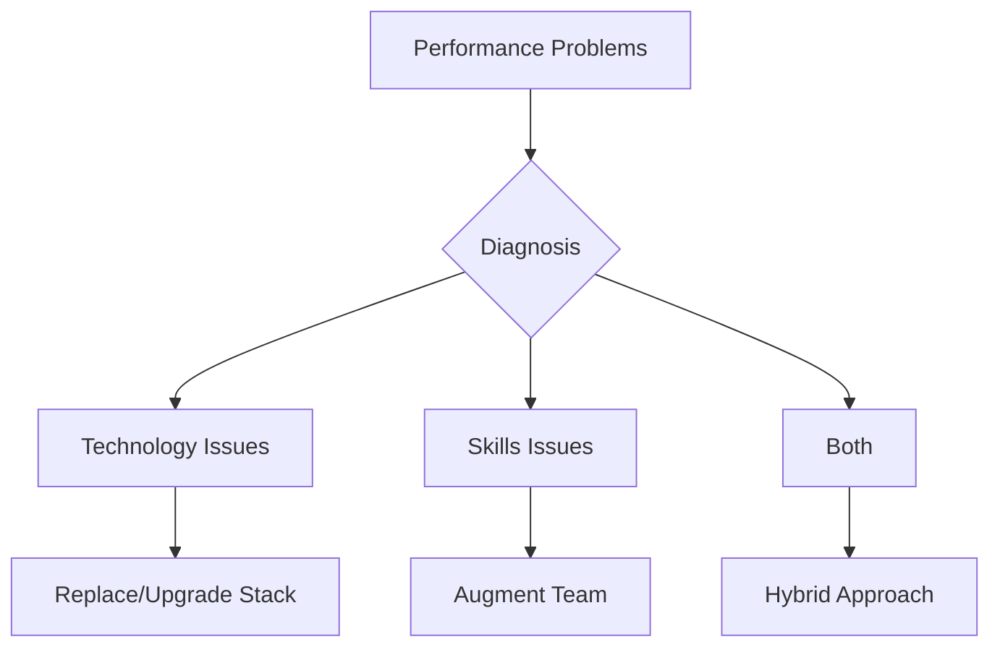
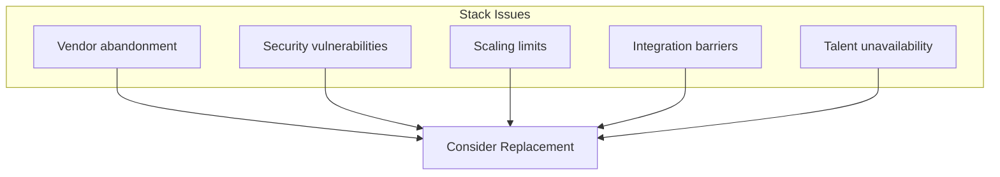
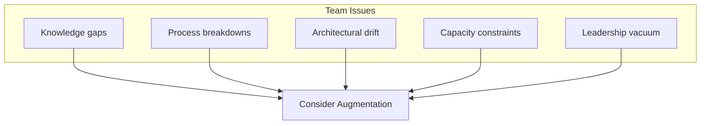
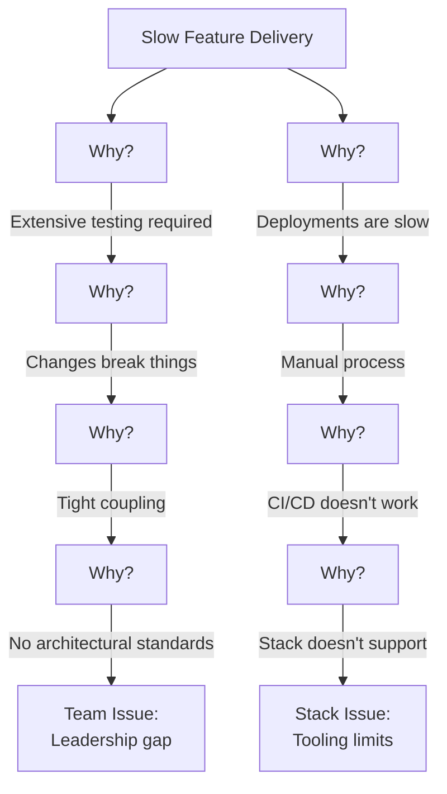
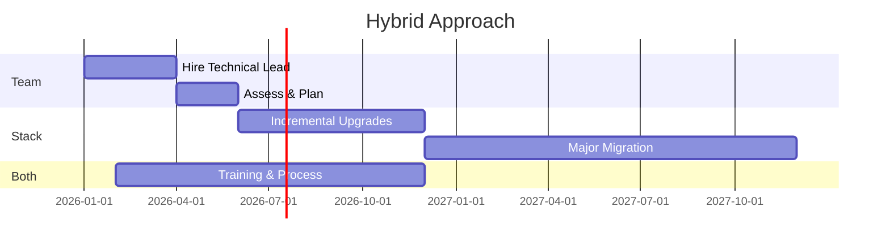

# When to Augment Your Team vs Replace Your Stack

Your system is slow. Deployments are painful. Features take forever. Leadership is frustrated.

The debate begins: "We need to rewrite this in a modern stack" vs. "We need better developers."

Both answers can be right. Both can be expensive mistakes. Here's how to diagnose correctly.

## The Diagnostic Framework

The wrong diagnosis leads to wasted investment:

- Replace the stack when the problem is skills → New stack, same problems
- Add people when the problem is technology → More people fighting bad tools
- Do both when only one was needed → 2x the cost, 2x the disruption

## Signs the Stack Is the Problem

### 1. Vendor or Community Abandonment

The framework is deprecated. Security patches have stopped. The community has moved on. Even expert developers can't get support or find solutions.

**Evidence:** No recent releases, dwindling Stack Overflow activity, vendors recommending migration paths.

### 2. Fundamental Security Issues

The platform has architectural security flaws that can't be patched. Compliance requirements can't be met without replacement.

**Evidence:** Security audits failing repeatedly, CVEs without fixes, regulatory requirements impossible to meet.

### 3. Hard Scaling Limits

The technology has fundamental limits that your business has hit. No amount of optimization can overcome architectural constraints.

**Evidence:** Performance doesn't improve despite optimization, documentation confirms limits, competitors on modern stacks outperform significantly.

### 4. Integration Impossibilities

The stack can't integrate with essential modern services. APIs, protocols, or data formats are incompatible with current requirements.

**Evidence:** Integration projects consistently fail or require extensive workarounds, vendors won't support your platform.

### 5. Talent Market Reality

Nobody knows this technology anymore. Hiring is impossible. Training takes too long.

**Evidence:** Months to fill positions, candidates reject offers when they learn the stack, salaries are premium for the skill set.

## Signs the Team Is the Problem

### 1. Knowledge Gaps

The team doesn't know the stack well enough. They're using it wrong, missing features, or fighting the framework instead of leveraging it.

**Evidence:** Other companies succeed with the same stack, documentation shows features the team doesn't use, external review identifies obvious improvements.

### 2. Process Breakdowns

The technology works fine in isolation. Integration, deployment, and operations are where things break down.

**Evidence:** Same bugs keep recurring, deployments are manual and error-prone, no automated testing, unclear ownership.

### 3. Architectural Drift

The system started well-architected but has degraded over time. It's not the stack—it's the accumulated shortcuts and compromises.

**Evidence:** Original architecture was sound, technical debt is documented as increasing, code reviews show declining standards.

### 4. Capacity Constraints

The team simply can't keep up. The backlog grows. Quality suffers not from lack of skill but lack of time.

**Evidence:** Good work when they have time, features delivered late but solid, team is clearly overextended.

### 5. Leadership Vacuum

No one owns technical direction. Decisions don't get made. Or they get made and reversed. Or different parts of the system go different directions.

**Evidence:** Inconsistent patterns across codebase, unresolved technical debates, no architectural standards.

## The Diagnosis Process

### Step 1: Gather Evidence

Don't rely on opinions. Collect data:

| Question | Data Source |
|----------|-------------|
| Is the stack capable? | Documentation, benchmarks, case studies |
| Are we using it right? | Code review, external assessment |
| What do similar companies do? | Industry research, network |
| Where do problems occur? | Incident analysis, performance metrics |
| What does the team say? | Interviews, retrospectives |

### Step 2: External Perspective

Internal teams have biases. Developers may want new technology. Managers may resist change. Get external input.

Options:
- Architecture review
- Code audit
- Technical assessment
- Industry benchmark comparison

### Step 3: Root Cause Analysis

For each major problem, trace back to root causes:

### Step 4: Solution Mapping

Map each root cause to a solution:

| Root Cause | Solution Type |
|------------|---------------|
| Stack limits | Upgrade or replace |
| Missing knowledge | Training or hiring |
| Process gaps | Process improvement |
| Capacity | Add team members |
| Architecture drift | Refactoring |
| Leadership gap | Technical leadership |

## Augmentation Options

When the team is the issue, consider:

### Option 1: Training and Development

Invest in existing team's skills. Works when the gap is specific and addressable.

**Timeline:** 3-6 months to see results
**Cost:** Low-medium
**Risk:** May not stick; people may leave

### Option 2: Strategic Hires

Add specific roles with specific skills. A senior architect. A DevOps specialist. A security engineer.

**Timeline:** 3-6 months to hire, 3-6 more to impact
**Cost:** Medium-high
**Risk:** Hiring is hard; integration takes time

### Option 3: Fractional Experts

Part-time senior talent. Fractional CTO, architect, or technical advisor. Get expertise without full-time commitment.

**Timeline:** Immediate to 1 month
**Cost:** Medium
**Risk:** Divided attention; knowledge transfer essential

### Option 4: Team Extension

Add developers through an agency or contractor relationship. Increase capacity while maintaining direction.

**Timeline:** 2-4 weeks
**Cost:** Medium-high
**Risk:** Integration; quality variance

## Stack Replacement Options

When the technology is the issue:

### Option 1: Incremental Upgrade

Stay in the same ecosystem but upgrade. Move from old version to new. Add modern tooling.

**Timeline:** 3-12 months
**Cost:** Medium
**Risk:** Compatibility issues

### Option 2: Strangler Fig Migration

Gradually replace components while keeping the system running. Build new around old.

**Timeline:** 12-24 months
**Cost:** Medium-high
**Risk:** Parallel maintenance burden

### Option 3: Rebuild

Start fresh with a modern stack. Port data and business logic.

**Timeline:** 12-36 months
**Cost:** High
**Risk:** Project failure; business disruption

## The Hybrid Path

Often, the answer is both. Augment the team AND modernize the stack—but sequence matters.

**Recommended sequence:**
1. Add technical leadership first
2. Diagnose properly with new perspective
3. Improve processes regardless of stack decision
4. Execute stack changes with strengthened team

## The Decision

| Diagnosis | Action |
|-----------|--------|
| Stack is fundamentally limited | Plan replacement |
| Team lacks specific skills | Targeted augmentation |
| Both are issues | Fix team first, then stack |
| Neither is clear | Get external assessment |

The worst outcome is guessing wrong. Take time to diagnose before committing to expensive solutions.

---

*ServiceVision provides technical assessment, team augmentation, and modernization services for established companies. We help you diagnose correctly and execute the right solution. [Let's assess your situation](/contact).*
