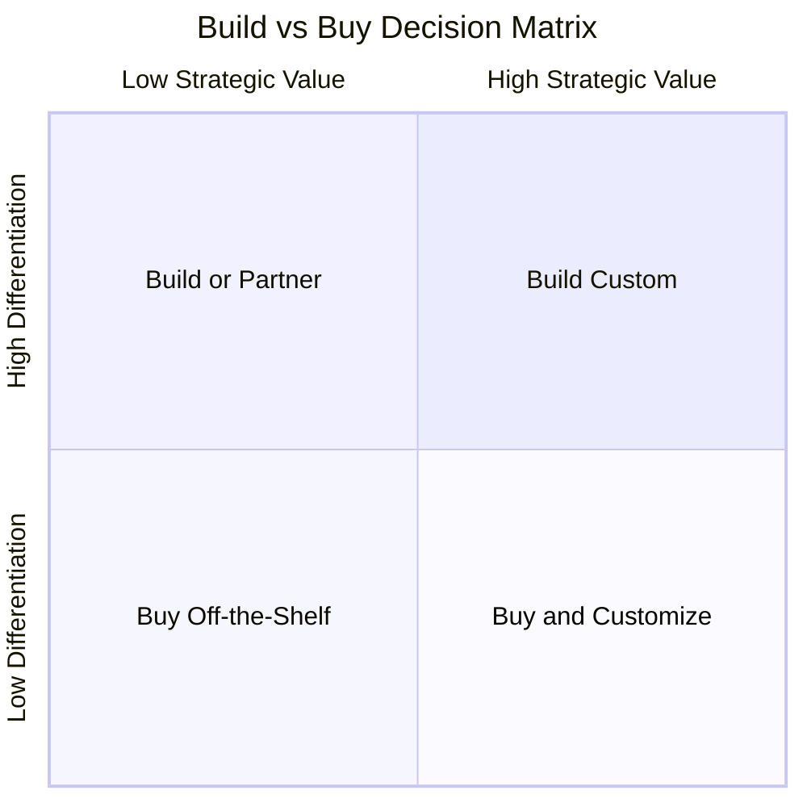
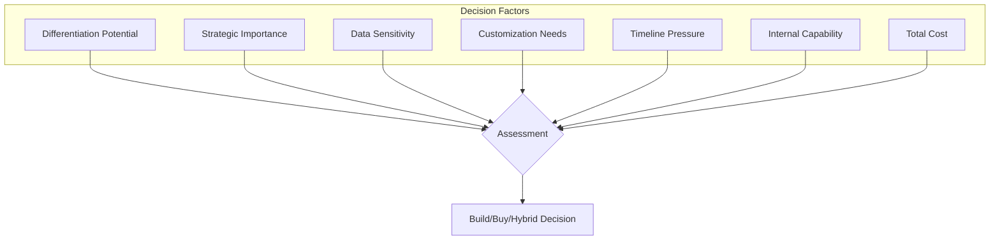
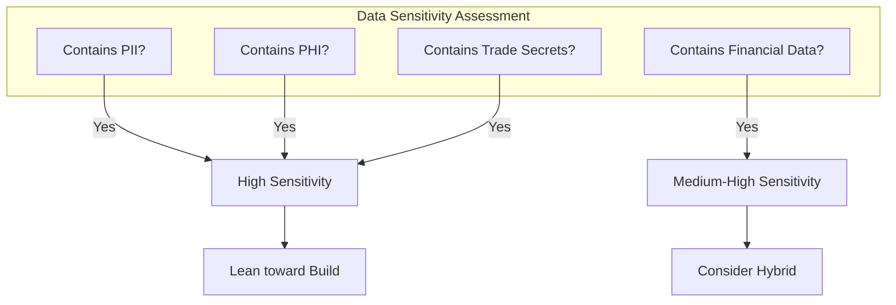
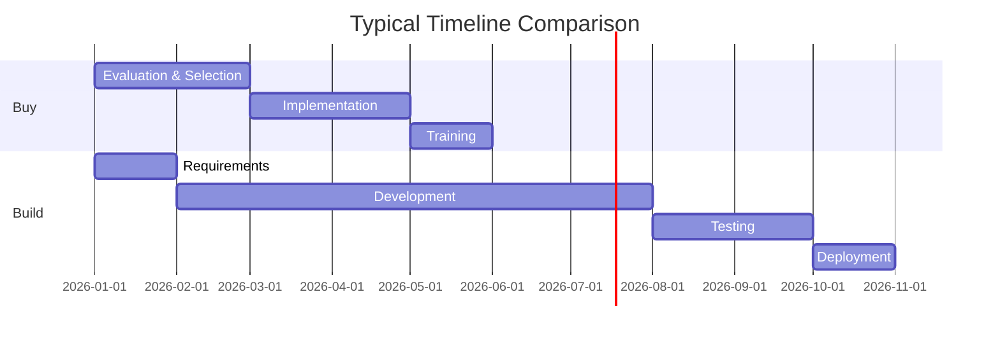
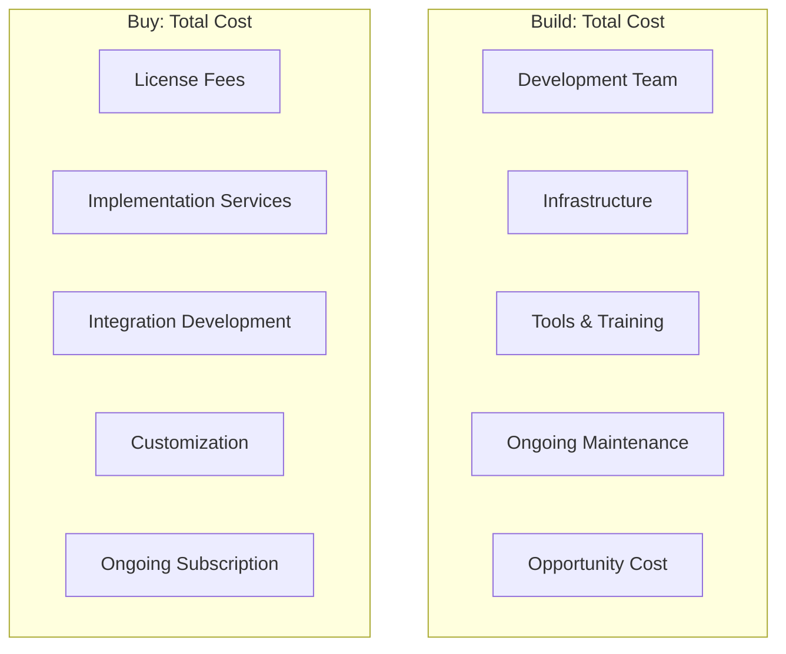
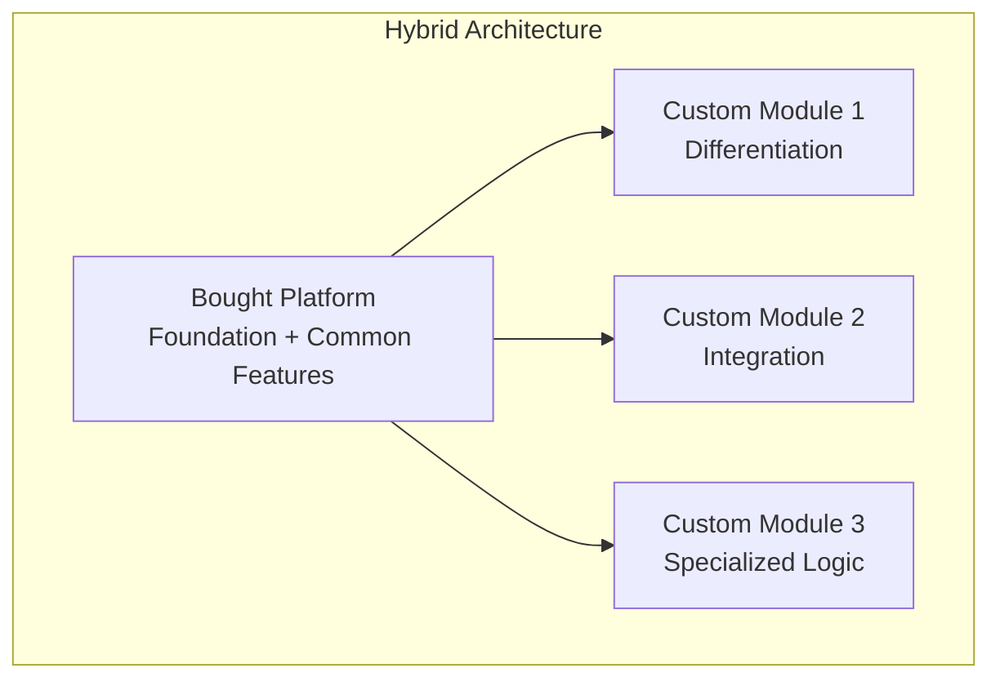
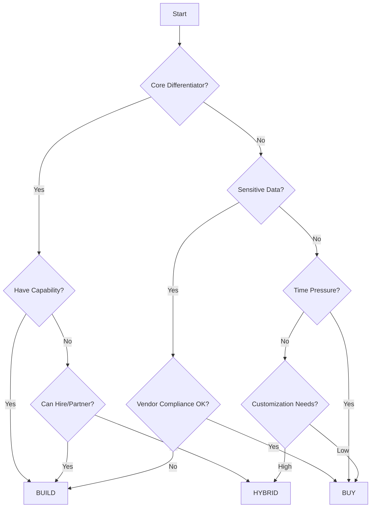

# Build vs Buy AI Solutions: A Framework for Established Companies

Every technology leader faces this question: should we build this AI capability ourselves, or buy an existing solution?

The answer isn't obvious. Building offers control and customization. Buying offers speed and proven functionality. The wrong choice can cost millions and years.

Here's a framework for making the decision.

## The Decision Matrix

### Quadrant Analysis

**High Differentiation + High Strategic Value = Build Custom**

This is your core competitive advantage. Custom AI that differentiates you from competitors. Worth the investment.

**High Differentiation + Low Strategic Value = Build or Partner**

Unique requirements but not core to the business. Consider partnerships or configurable platforms.

**Low Differentiation + High Strategic Value = Buy and Customize**

Important capability but not unique. Buy proven solutions, customize for your needs.

**Low Differentiation + Low Strategic Value = Buy Off-the-Shelf**

Commodity functionality. Buy the cheapest solution that meets requirements.

## The Evaluation Framework

### Factor 1: Differentiation Potential

**Ask:** Will this AI capability differentiate us from competitors?

If your AI-powered recommendation engine is why customers choose you over alternatives, that's high differentiation. Build it.

If you need AI for internal expense categorization, that's low differentiation. Buy it.

### Factor 2: Strategic Importance

**Ask:** How central is this to our business strategy?

A retail company's demand forecasting AI is strategically critical. A law firm's document AI might be important but not strategic.

Strategic importance doesn't always mean differentiation. Customer service AI might be critical to operations but not unique.

### Factor 3: Data Sensitivity

**Ask:** How sensitive is the data involved?

Highly sensitive data pushes toward building or on-premises solutions. You maintain control over where data resides and who can access it.

### Factor 4: Customization Requirements

**Ask:** How much will we need to customize the solution?

| Customization Level | Implication |
|---------------------|-------------|
| None | Buy off-the-shelf |
| Configuration only | Buy configurable platform |
| Moderate | Buy and extend |
| Extensive | Build or platform + custom |
| Complete | Build custom |

If you'll spend more customizing a purchased solution than building from scratch, build.

### Factor 5: Timeline Pressure

**Ask:** How quickly do we need this?

Buying is almost always faster. If you need capability in 3 months, building is rarely an option.

### Factor 6: Internal Capability

**Ask:** Do we have the skills to build this?

Building AI requires:
- Data scientists / ML engineers
- Data engineers
- MLOps expertise
- Domain expertise
- Ongoing maintenance capacity

If you don't have these skills, buying becomes more attractive—or you need to factor in hiring or partnering.

### Factor 7: Total Cost of Ownership

**Ask:** What's the true cost over 5 years?

Build costs that are often underestimated:
- Ongoing maintenance (plan for 20-30% of build cost annually)
- Model retraining and monitoring
- Infrastructure and MLOps
- Staff turnover and knowledge transfer

Buy costs that are often underestimated:
- Integration and customization
- Data migration
- Training and change management
- Annual subscription increases

## The Hybrid Approach

Often the best answer is neither pure build nor pure buy. It's a combination.

### Hybrid Patterns

**Pattern 1: Platform + Custom Models**
Buy an ML platform (AWS SageMaker, Google Vertex AI, Azure ML) and build custom models on top.

**Pattern 2: API Composition**
Buy multiple AI APIs (OpenAI, AWS, Google) and build custom orchestration and business logic.

**Pattern 3: Vendor Core + Custom Extensions**
Buy a vendor solution for 80% of functionality, build custom extensions for the 20% that differentiates.

**Pattern 4: Build Core + Buy Periphery**
Build the core differentiating AI, buy commodity supporting capabilities.

## Case Studies

### Case 1: Financial Services Firm

**Need:** Fraud detection AI

**Analysis:**
- Differentiation: Medium (competitors have similar needs)
- Strategic importance: High (prevents significant losses)
- Data sensitivity: Very high (PII, financial data)
- Customization: High (unique transaction patterns)

**Decision:** Hybrid—Buy fraud detection platform, train custom models with proprietary data, keep all data on-premises.

### Case 2: Healthcare Organization

**Need:** Medical document classification

**Analysis:**
- Differentiation: Low
- Strategic importance: Medium
- Data sensitivity: Very high (PHI, HIPAA)
- Customization: Medium

**Decision:** Buy specialized healthcare AI vendor with BAA and HIPAA compliance built in. Customize categories.

### Case 3: E-commerce Company

**Need:** Product recommendation engine

**Analysis:**
- Differentiation: High (core to customer experience)
- Strategic importance: Very high
- Data sensitivity: Medium
- Customization: Very high

**Decision:** Build custom. This is core competitive advantage.

## Red Flags for Each Approach

### Build Red Flags

- No internal ML/AI expertise
- Tight deadline
- Commodity functionality
- Unclear requirements
- Budget constraints

### Buy Red Flags

- Highly sensitive data with no adequate vendor security
- Extensive customization required
- Core competitive differentiator
- Vendor lock-in concerns
- Regulatory requirements vendors can't meet

## The Decision Process

## The Bottom Line

The build vs buy decision isn't about technology preference. It's about:

1. **Differentiation**: Build what differentiates you
2. **Speed**: Buy when time matters more than uniqueness
3. **Control**: Build when you need complete control over data and logic
4. **Capability**: Be honest about what you can actually build
5. **Cost**: Calculate true TCO, not just upfront costs

Most established companies will end up with a portfolio: some built, some bought, some hybrid. The key is making the right choice for each capability.

---

*ServiceVision helps established companies navigate build vs buy decisions for AI and technology investments. We bring 20+ years of enterprise experience to help you make the right choice for your situation. [Let's evaluate your options](/contact).*
