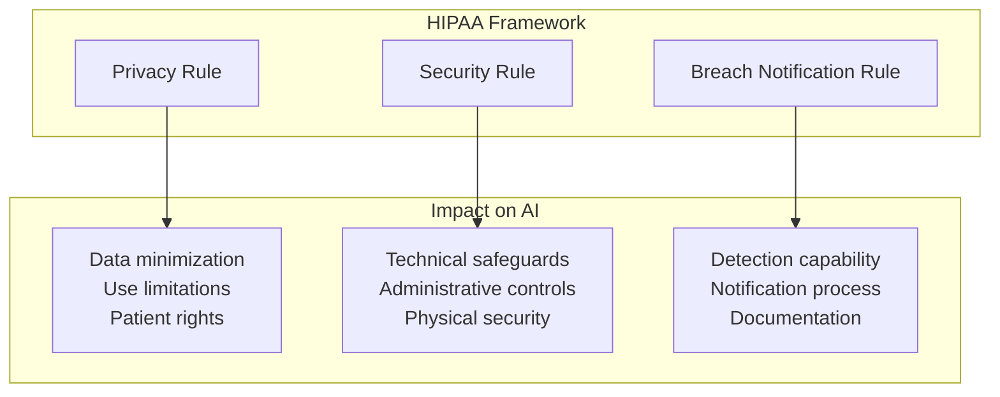
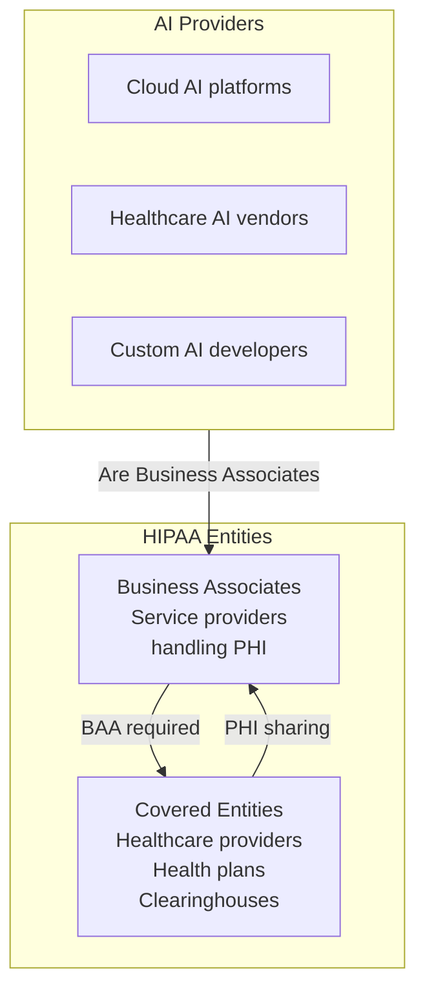
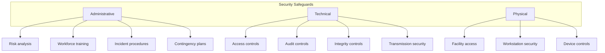
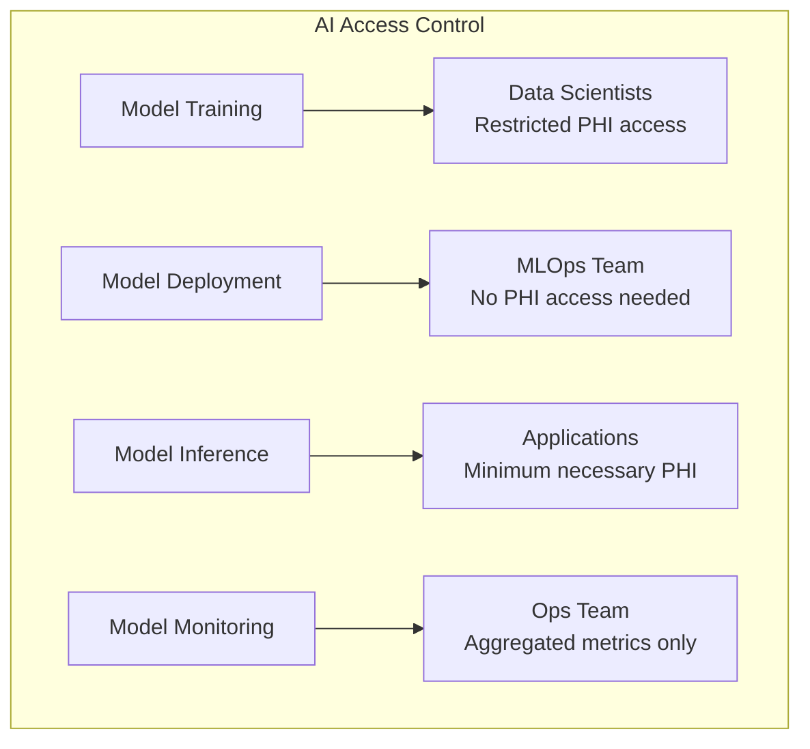
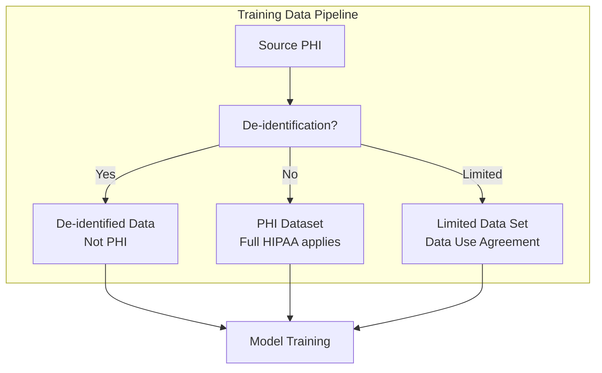
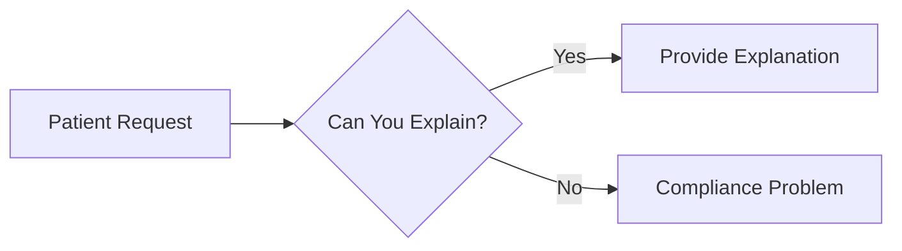
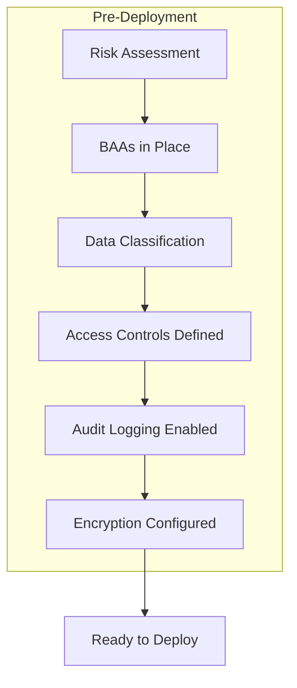
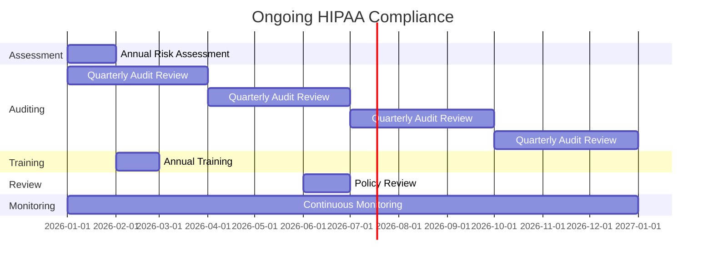
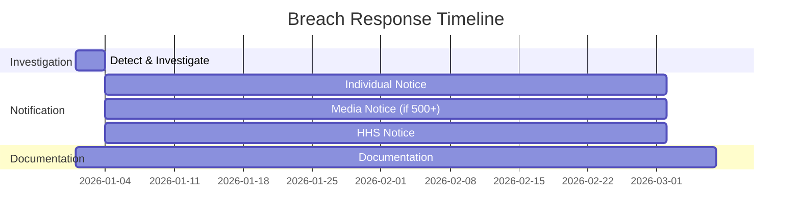

# HIPAA-Compliant AI: A Practical Guide

AI in healthcare promises better diagnoses, personalized treatment, and operational efficiency. HIPAA compliance promises lawyers, audits, and potential penalties.

You need both.

This guide covers the practical reality of deploying AI systems that handle Protected Health Information (PHI).

## HIPAA Fundamentals for AI

### What HIPAA Protects

Protected Health Information (PHI) includes:

| Category | Examples |
|----------|----------|
| Identifiers | Name, address, SSN, phone, email |
| Medical | Diagnoses, treatments, test results |
| Financial | Payment information, insurance data |
| Administrative | Appointment dates, admission records |
| Derived | AI predictions based on PHI |

**Critical point:** AI predictions derived from PHI are themselves PHI and subject to HIPAA requirements.

### Who Must Comply

If you're building AI that touches PHI, you're a Business Associate. You need:
- Business Associate Agreement (BAA) with covered entities
- HIPAA compliance program
- Breach notification procedures

## Technical Requirements

### The Security Rule's Three Safeguards

### Technical Safeguards for AI Systems

#### Access Controls

Who can access the AI system and the data it uses?

**Requirements:**
- Unique user identification
- Emergency access procedures
- Automatic logoff
- Encryption and decryption

**AI-specific considerations:**
- Who can query the model?
- Who can access training data?
- Who can modify the model?
- How are API keys managed?

#### Audit Controls

Can you track who did what?

**Requirements:**
- Record and examine activity
- System activity review
- Audit log protection

**AI-specific considerations:**
- Log all inference requests with user context
- Track model versions and deployments
- Record training data access
- Audit model changes

#### Integrity Controls

Is the data accurate and unaltered?

**Requirements:**
- Mechanism to authenticate PHI
- Implement electronic PHI protection

**AI-specific considerations:**
- Training data integrity verification
- Model integrity verification (prevent tampering)
- Input validation for inference
- Output validation and consistency checks

#### Transmission Security

Is data protected in transit?

**Requirements:**
- Integrity controls
- Encryption

**AI-specific considerations:**
- Encrypt API calls to/from AI systems
- Secure model deployment pipelines
- Protected data transfer for training
- Secure feature pipeline data movement

## AI-Specific HIPAA Challenges

### Challenge 1: Training Data

Training AI on PHI requires careful handling.

**Options:**

1. **De-identified data**: Remove the 18 HIPAA identifiers. No longer PHI. But may lose predictive value.

2. **Limited Data Set**: Removes direct identifiers but retains some information. Requires Data Use Agreement. Less restrictive than full PHI.

3. **Full PHI**: Most predictive value but highest compliance burden.

### Challenge 2: Model Memorization

AI models can memorize training data, potentially leaking PHI.

**Risks:**
- Model inversion attacks extract training data
- Membership inference reveals if data was in training set
- Overfitted models regurgitate training examples

**Mitigations:**
- Differential privacy in training
- Regularization to prevent memorization
- Minimum training data size requirements
- Output filtering for potential PHI
- Regular model audits

### Challenge 3: Explainability

HIPAA gives patients rights to access their information. If AI makes decisions about patients, can you explain them?

**Requirements:**
- Document how AI influences decisions
- Be able to explain specific predictions
- Maintain records of AI decision-making
- Allow patient access to AI-generated records

### Challenge 4: Third-Party AI

Using OpenAI, Google Cloud AI, or other third-party AI services with PHI?

**Requirements:**
- BAA must be in place (not all providers offer this)
- Understand where data flows
- Know data retention policies
- Verify security certifications

| Provider | BAA Available | HIPAA Eligible |
|----------|---------------|----------------|
| AWS | Yes | Yes (specific services) |
| Google Cloud | Yes | Yes (specific services) |
| Azure | Yes | Yes (specific services) |
| OpenAI | Limited | Via Azure only |
| Anthropic | Enterprise | Enterprise only |

**Warning:** Consumer AI services (ChatGPT consumer, Gemini consumer) are NOT HIPAA-compliant. Never paste PHI into consumer AI tools.

## Implementation Checklist

### Before Deploying AI with PHI

**Checklist:**

- [ ] **Risk assessment** completed for AI system
- [ ] **BAAs** signed with all parties handling PHI
- [ ] **Data inventory** documenting all PHI in AI pipeline
- [ ] **Minimum necessary** standard applied to data access
- [ ] **Encryption** at rest and in transit
- [ ] **Access controls** implemented with unique IDs
- [ ] **Audit logging** for all PHI access and AI operations
- [ ] **Incident response** procedures for AI-specific scenarios
- [ ] **Training** for all staff with AI system access
- [ ] **Documentation** of AI decision-making processes

### Ongoing Compliance

**Ongoing requirements:**

- Regular risk assessments (annual minimum)
- Audit log review (regular schedule)
- Access review (who still needs access?)
- Training refresh (annual minimum)
- Policy updates (as technology changes)
- Incident documentation (ongoing)
- BAA management (renewals, changes)

## Breach Response

### What Constitutes a Breach?

Unauthorized acquisition, access, use, or disclosure of PHI that compromises security or privacy.

**AI-specific breach scenarios:**
- Training data exposed
- Model reveals PHI through inference
- Unauthorized API access
- Model theft with embedded PHI patterns

### Response Timeline

**Requirements:**
- Notify affected individuals within 60 days
- Notify HHS (timing depends on breach size)
- Notify media if 500+ individuals in a state
- Document everything

## The Bottom Line

HIPAA-compliant AI is achievable but requires:

1. **Understanding** that AI outputs derived from PHI are PHI
2. **Planning** compliance into architecture from day one
3. **Documenting** all data flows, access, and decisions
4. **Monitoring** continuously for compliance and breaches
5. **Training** everyone who touches the system

The investment in compliance is significant. The cost of non-compliance—fines up to $1.9 million per violation category per year, plus reputational damage—is higher.

---

*ServiceVision has a 100% compliance record across 20+ years of healthcare technology work. We build HIPAA compliance into AI systems from architecture through deployment. [Let's discuss your healthcare AI needs](/contact).*
