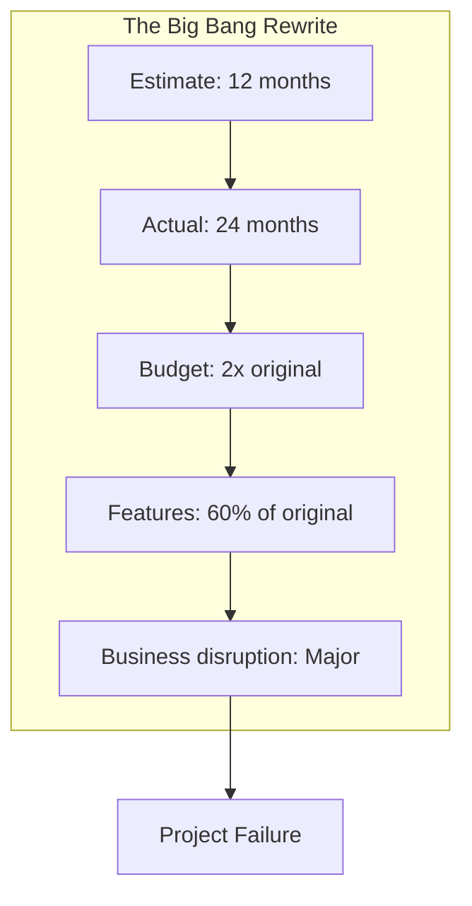
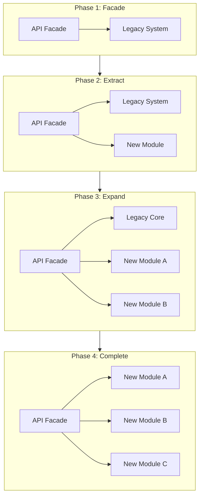
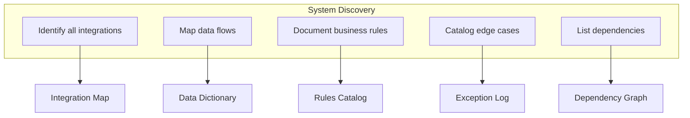
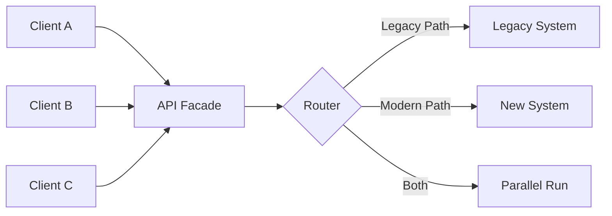
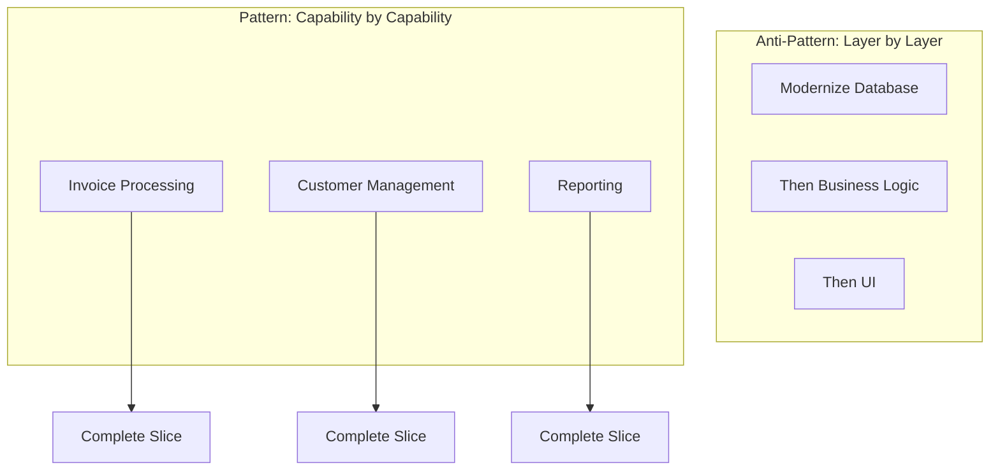
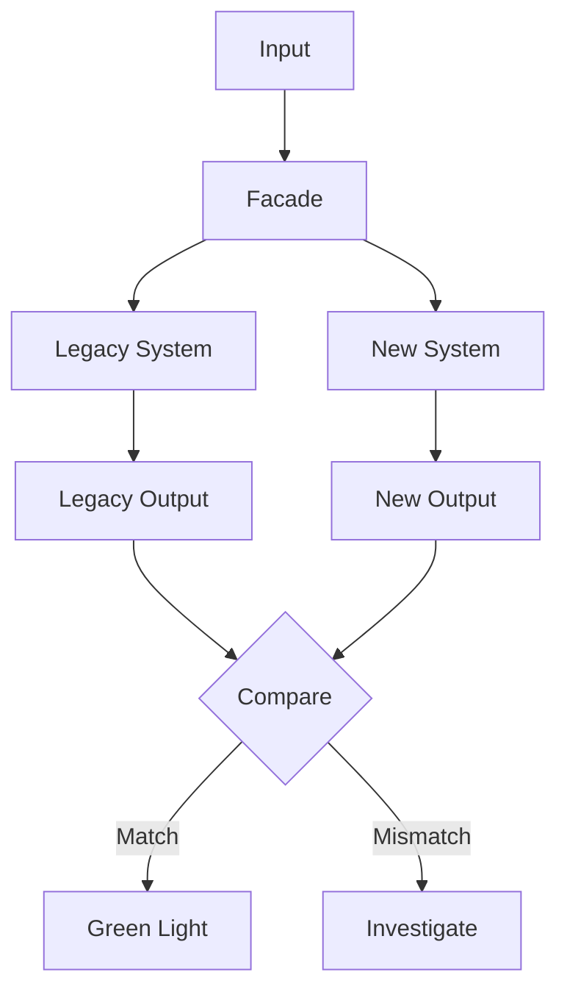
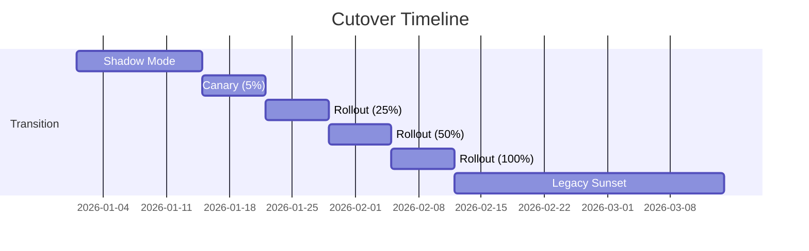

# Legacy System Modernization Without the Rewrite

Every established company has them: the systems that run the business but haven't been touched in years. The COBOL mainframe. The VB6 application. The Access database that somehow became mission-critical.

The conventional wisdom says: rewrite it. Start fresh. Build it right this time.

That's a trap.

## The Rewrite Trap

The statistics on major system rewrites are brutal:

- **70%** of large-scale rewrites fail or are significantly delayed
- Average cost overrun: **189%**
- Average schedule overrun: **222%**
- Feature parity at launch: rarely achieved

Why? Because legacy systems embody years of accumulated business logic, edge cases, and institutional knowledge. It's not documented. It's in the code—and often only in the code.

When you rewrite, you don't just rebuild features. You rediscover why every weird workaround exists.

## The Strangler Fig Pattern

There's a better way. Instead of replacing the legacy system all at once, gradually grow a new system around it—like a strangler fig tree growing around its host.

### How It Works

1. **Facade First**: Put an API layer in front of the legacy system. All new development talks to the facade, not directly to the legacy system.

2. **Extract Incrementally**: Pull functionality out of the legacy system one piece at a time. The facade routes requests to either the legacy system or the new implementation.

3. **Verify Continuously**: Run the old and new systems in parallel. Compare outputs. Catch discrepancies before they reach production.

4. **Strangle Gradually**: As more functionality moves to new systems, the legacy system handles less. Eventually, it can be retired.

## Real-World Implementation

### Step 1: Map the Territory

Before touching code, understand what you have:

Key questions:
- What other systems depend on this one?
- What data does it own vs. consume?
- What business rules are encoded in the code?
- Who knows how it actually works?

### Step 2: Build the Facade

The facade is your control point. Everything goes through it.

The facade should:
- Present a clean, modern API to consumers
- Handle authentication and authorization
- Log all requests and responses
- Support feature flags for routing decisions
- Enable parallel execution for verification

### Step 3: Extract by Business Capability

Don't extract by technical layer. Extract by business capability.

**Wrong approach**: "Let's modernize the database first, then the business logic, then the UI."

**Right approach**: "Let's modernize the invoice processing capability end-to-end, including its data, logic, and interfaces."

Capability-by-capability extraction:
- Delivers value incrementally
- Reduces blast radius of failures
- Enables learning before tackling harder pieces
- Shows progress to stakeholders

### Step 4: Parallel Running

Before cutting over, run both systems simultaneously:

Parallel running catches:
- Logic differences
- Edge cases you missed
- Data transformation errors
- Performance discrepancies

Run in parallel until you trust the new system. This might be days, weeks, or months depending on the criticality.

### Step 5: Incremental Cutover

Don't flip a switch. Roll out gradually:

1. **Shadow mode**: New system runs but results aren't used
2. **Canary**: 5% of traffic goes to new system
3. **Gradual rollout**: Increase percentage as confidence grows
4. **Full cutover**: All traffic to new system
5. **Legacy sunset**: Old system decommissioned

## Common Pitfalls

### Pitfall 1: Modernizing Everything at Once

"While we're in there, let's also..."

No. Resist scope creep. Modernize what you planned to modernize. Improvements can come later.

### Pitfall 2: Ignoring the Data

The hardest part of legacy modernization is usually the data. Years of accumulated cruft, inconsistencies, and undocumented conventions.

Plan for significant data cleaning and transformation work.

### Pitfall 3: Losing Institutional Knowledge

The people who built the legacy system may be gone. The people who maintain it may be retiring soon. Capture their knowledge before they leave.

### Pitfall 4: Underestimating Testing

Legacy systems often lack tests. Before you can safely modernize, you need to understand current behavior—which means building a test harness around what exists.

## Technology Choices

The strangler pattern is technology-agnostic. Common choices:

| Layer | Options |
|-------|---------|
| API Facade | Kong, AWS API Gateway, custom reverse proxy |
| Service Communication | REST, gRPC, message queues |
| Data Sync | Change Data Capture, ETL, dual-write |
| Feature Flags | LaunchDarkly, Unleash, custom |
| Comparison Engine | Custom, database diffing tools |

The right choice depends on your existing stack, team skills, and specific requirements.

## When to Actually Rewrite

Sometimes the strangler pattern isn't feasible:

- The legacy system has no API or integration points
- The codebase is too tangled to extract pieces
- The technology is so obsolete that no one can maintain it
- Regulatory requirements mandate a specific architecture

Even then, consider whether you can wrap and isolate before rewriting.

## The Bottom Line

You don't have to bet the company on a multi-year rewrite. The strangler fig pattern lets you:

- Modernize incrementally
- Deliver value continuously
- Manage risk carefully
- Learn as you go

The legacy system didn't get built in a day. It doesn't have to be replaced in a day either.

---

*ServiceVision has modernized legacy systems across financial services, healthcare, and government sectors. We specialize in low-risk, incremental transformation that keeps the business running while technology evolves. [Let's assess your modernization options](/contact).*
