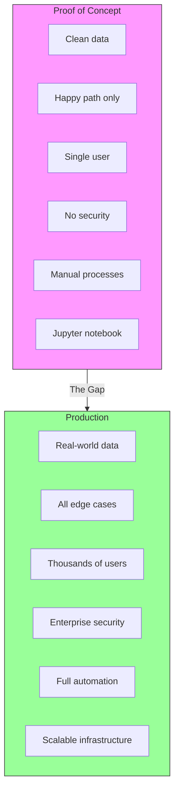
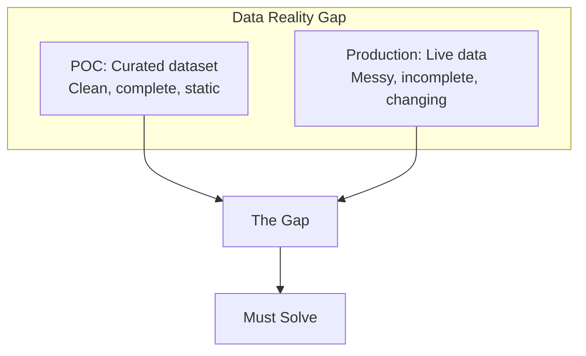
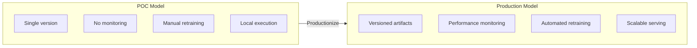
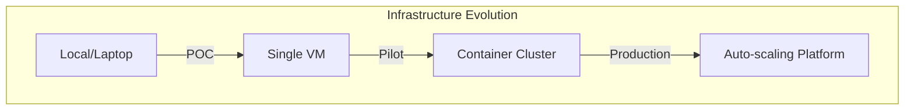
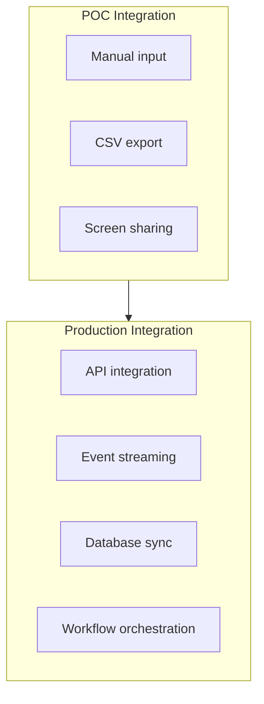
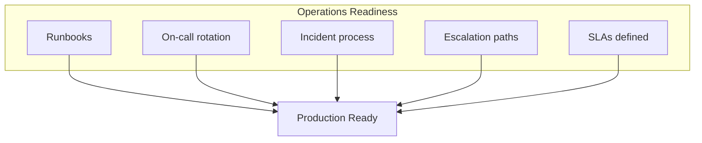
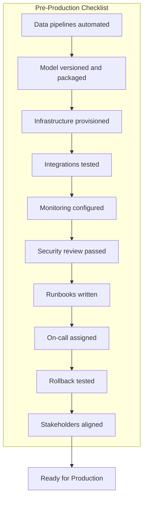
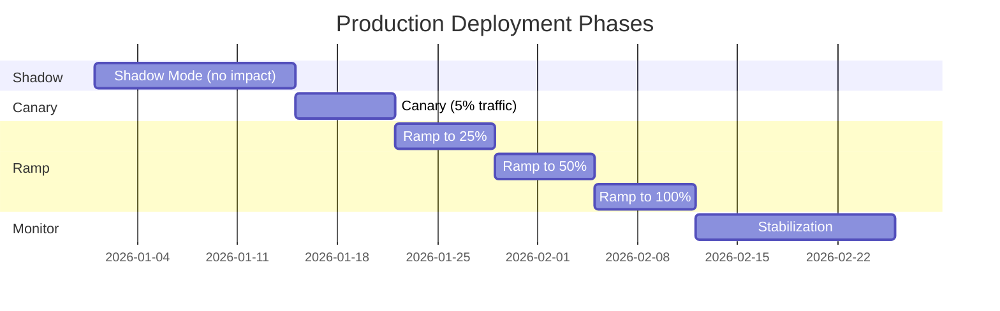
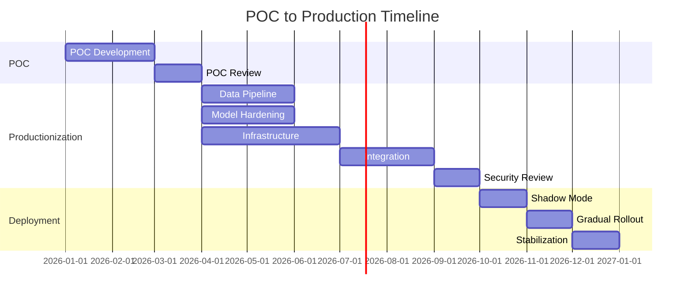

# From Proof of Concept to Production: Enterprise AI Deployment

The demo went great. The model predicts accurately. Leadership is excited.

"Let's deploy it to production!"

Six months later, you're still "almost ready." The POC that worked perfectly is stuck in what we call "pilot purgatory"—too good to kill, too incomplete to deploy.

This is where most enterprise AI projects die. Here's how to survive.

## The POC-Production Gap

The gap between POC and production is not incremental. It's a category change. Everything that made the POC fast and successful—shortcuts, assumptions, manual steps—becomes a liability in production.

## The Production Readiness Framework

### Stage 1: Data Production-Readiness

POC data and production data are different animals.

**Production data requirements:**

| Requirement | POC Approach | Production Approach |
|-------------|--------------|---------------------|
| Data quality | Manual cleaning | Automated validation |
| Data freshness | Static snapshot | Real-time pipelines |
| Schema changes | Ignore | Handle gracefully |
| Missing values | Exclude | Impute or flag |
| Data volume | Sample | Full scale |
| Data lineage | Unknown | Fully tracked |

**Action items:**
- Build automated data validation pipelines
- Implement data quality monitoring
- Design for schema evolution
- Create data versioning
- Document data lineage end-to-end

### Stage 2: Model Production-Readiness

The model itself needs hardening.

**Model production requirements:**

- **Versioning**: Every model artifact versioned and reproducible
- **Packaging**: Model packaged with dependencies, containerized
- **Serving**: Inference endpoint with defined SLAs
- **Monitoring**: Accuracy, latency, throughput dashboards
- **Retraining**: Automated pipeline triggered by drift or schedule
- **Rollback**: Ability to revert to previous model version instantly

### Stage 3: Infrastructure Production-Readiness

Jupyter notebooks don't scale.

**Infrastructure requirements:**

- **Compute**: Right-sized, auto-scaling, cost-optimized
- **Storage**: Appropriate for data volume and access patterns
- **Networking**: Secure, performant, properly segmented
- **Orchestration**: Kubernetes or managed ML platforms
- **CI/CD**: Automated build, test, deploy pipelines
- **Observability**: Logging, metrics, tracing, alerting

### Stage 4: Integration Production-Readiness

The POC stood alone. Production connects to everything.

**Integration requirements:**

- **APIs**: Well-documented, versioned, authenticated
- **Error handling**: Graceful failures, meaningful errors
- **Retry logic**: Transient failure recovery
- **Circuit breakers**: Prevent cascade failures
- **Timeouts**: Defined and enforced
- **Backwards compatibility**: Don't break consumers

### Stage 5: Operations Production-Readiness

Who wakes up at 3 AM when it breaks?

**Operations requirements:**

- **Runbooks**: Step-by-step procedures for common issues
- **On-call**: Defined responsibility and rotation
- **Monitoring**: Alerts that trigger action
- **Incident management**: Clear process from detection to resolution
- **SLAs**: Defined, measured, reported
- **Capacity planning**: Understand growth requirements

### Stage 6: Compliance Production-Readiness

Your POC bypassed security review. Production can't.

**Compliance requirements:**

- **Security review**: Penetration testing, vulnerability assessment
- **Access controls**: Role-based, least privilege
- **Audit logging**: Who did what, when
- **Data privacy**: PHI, PII handling verified
- **Regulatory**: Industry-specific requirements met
- **Documentation**: Policies and procedures documented

## The Production Deployment Checklist

### Pre-Flight Checklist

### Deployment Strategy

Don't flip a switch. Deploy gradually.

**Deployment phases:**

1. **Shadow Mode**: Run in production, compare outputs, take no action
2. **Canary**: Small percentage of traffic, real impact, close monitoring
3. **Gradual Ramp**: Increase traffic as confidence grows
4. **Full Production**: All traffic, normal operations
5. **Stabilization**: Intense monitoring period before declaring success

### Rollback Procedures

Things will go wrong. Be ready.

**Rollback triggers:**
- Accuracy below threshold
- Latency above SLA
- Error rate spike
- Unexpected behavior reported
- Business impact detected

**Rollback procedure:**
1. Detect issue (automated or reported)
2. Assess severity (continue, mitigate, or rollback)
3. Execute rollback (previous model version, feature flag off)
4. Verify rollback successful
5. Investigate root cause
6. Fix and re-deploy when ready

## Common Pitfalls

### Pitfall 1: Underestimating the Gap

"The POC is 80% done, so production is only 20% more work."

No. Production is often 10x the POC effort. Budget accordingly.

### Pitfall 2: Skipping Shadow Mode

"We tested it, let's just deploy."

Shadow mode catches problems that testing doesn't—real data, real scale, real integrations.

### Pitfall 3: No Rollback Plan

"It worked in staging, it'll work in production."

Always have a rollback plan. Test it. Document it. Practice it.

### Pitfall 4: Declaring Victory Too Early

"It's deployed, we're done!"

The first week of production is the beginning, not the end. Monitor intensely. Expect problems.

### Pitfall 5: Forgetting About Maintenance

"Let's move on to the next project."

AI systems need ongoing care—retraining, monitoring, updates. Budget for it.

## The POC-to-Production Timeline

Realistic timeline for enterprise AI deployment:

**Total: 12-18 months from POC start to stable production**

This isn't slow—it's realistic for enterprise AI with proper productionization.

## The Bottom Line

The POC is proof that AI can work. Production is proof that it works reliably, at scale, within constraints, day after day.

Most enterprise AI projects that fail don't fail at POC. They fail at productionization—because teams underestimate the gap, skip necessary steps, or run out of patience and budget.

Plan for the full journey. Budget for productionization. Deploy gradually. Monitor intensely. And have a rollback plan.

---

*ServiceVision specializes in taking AI from proof of concept to production. We've done it across healthcare, finance, and government—with a 100% compliance record. [Let's get your AI to production](/contact).*
