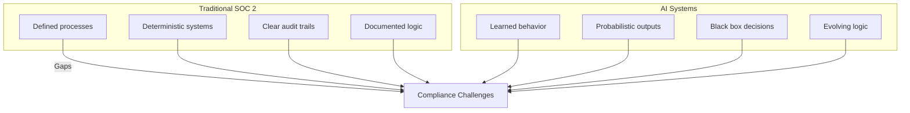
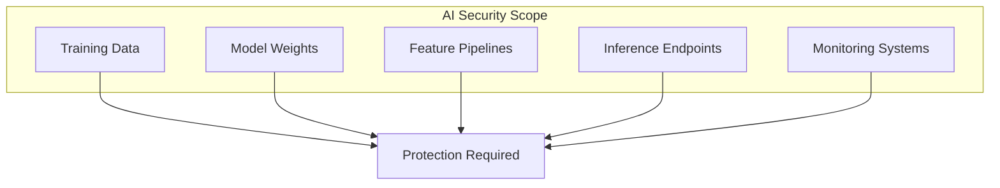
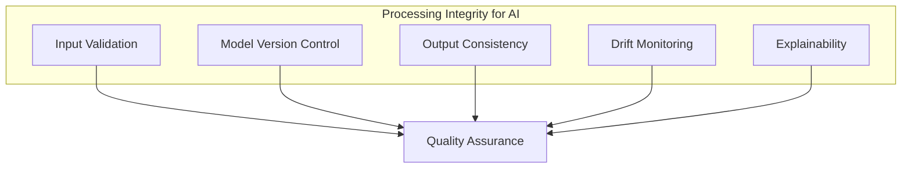
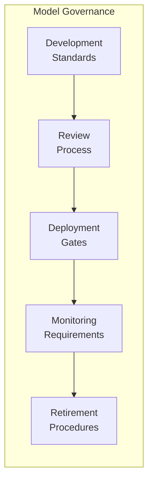
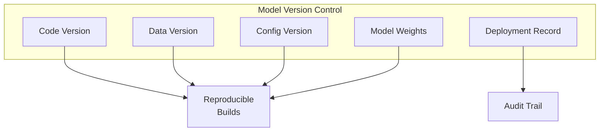
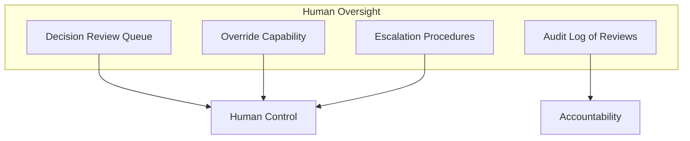

# SOC 2 Compliance in the Age of AI

Your organization achieved SOC 2 compliance. Your controls are documented. Your audits pass. Then you deploy AI systems—and suddenly, auditors are asking questions you can't answer.

"How do you ensure the AI's decisions are consistent?"
"Where's the audit trail for model changes?"
"How do you know the training data didn't include prohibited information?"

SOC 2 wasn't designed for AI. But your auditors expect compliance anyway.

## The AI Compliance Gap

Traditional software does what it's programmed to do. Every time. AI systems learn from data, make probabilistic decisions, and change over time. This breaks fundamental assumptions of traditional compliance frameworks.

## SOC 2 Trust Service Criteria and AI

SOC 2 evaluates five Trust Service Criteria. Here's how AI affects each:

### Security

**Traditional concern:** Protect systems and data from unauthorized access.

**AI complication:**
- Model weights are intellectual property—are they protected?
- Training data may be more sensitive than production data
- Adversarial attacks can manipulate model behavior
- Model serving endpoints need protection

**Controls needed:**
- Access controls for training data and models
- Encryption for model storage and transfer
- API security for inference endpoints
- Monitoring for adversarial inputs

### Availability

**Traditional concern:** Systems are available for operation and use.

**AI complication:**
- Model inference has different scaling characteristics
- GPU/TPU resources may have availability constraints
- Model degradation can reduce effective availability
- Retraining can cause downtime

**Controls needed:**
- SLAs for model inference latency
- Failover procedures for model serving
- Graceful degradation when models fail
- Resource monitoring and capacity planning

### Processing Integrity

**Traditional concern:** System processing is complete, accurate, timely, and authorized.

**AI complication:**
- AI outputs are probabilistic, not deterministic
- Model drift can change accuracy over time
- Training data issues can introduce systematic errors
- Explaining "why" is often difficult

**Controls needed:**
- Input validation and sanitization
- Model versioning and rollback capability
- Accuracy monitoring and thresholds
- Explainability documentation
- Human review for critical decisions

### Confidentiality

**Traditional concern:** Protect confidential information.

**AI complication:**
- Training data may contain confidential information
- Models can memorize and leak training data
- Inference inputs and outputs may be confidential
- Model inversion attacks can extract training data

**Controls needed:**
- Training data classification and handling
- Privacy-preserving training techniques
- Inference logging with appropriate retention
- Access controls for model querying

### Privacy

**Traditional concern:** Personal information is collected, used, retained, and disclosed appropriately.

**AI complication:**
- Training data may include personal information
- AI can infer personal information from non-PII
- Automated decision-making has privacy implications
- Right to explanation for automated decisions

**Controls needed:**
- Privacy impact assessments for AI systems
- Data minimization in training
- Consent management for AI processing
- Explanation capabilities for affected individuals

## Building Compliant AI Systems

### Control 1: Model Governance Framework

Document and enforce how models are developed, deployed, and maintained.

**Required documentation:**
- Model development lifecycle
- Approval workflows
- Deployment checklists
- Monitoring dashboards
- Incident response procedures

### Control 2: Training Data Management

Know what data trained your models and ensure appropriate handling.

| Data Element | Required Documentation |
|--------------|------------------------|
| Data source | Origin, collection method, legal basis |
| Data content | Fields, sensitivity classification |
| Data quality | Validation procedures, quality metrics |
| Data retention | Retention period, deletion procedures |
| Data access | Who can access, for what purpose |

### Control 3: Model Versioning and Audit Trail

Every model change must be tracked and auditable.

**Track:**
- Training code version
- Training data version
- Hyperparameters
- Model weights/artifacts
- Deployment timestamps
- Who approved each deployment

### Control 4: Monitoring and Alerting

Continuous monitoring for performance, accuracy, and anomalies.

**Monitor:**
- Inference latency
- Error rates
- Accuracy metrics
- Input distribution shifts
- Output distribution shifts
- Resource utilization

**Alert on:**
- Accuracy below threshold
- Significant drift detected
- Unusual input patterns (potential attacks)
- Resource exhaustion
- Availability issues

### Control 5: Human Oversight and Override

Maintain human control over AI decisions.

**Implement:**
- Review queues for high-risk decisions
- Override procedures with documentation
- Escalation paths
- Audit logging of all human interventions

### Control 6: Incident Response for AI

AI systems can fail in unique ways. Prepare for them.

**AI-specific incidents:**
- Model serving outage
- Significant accuracy degradation
- Data pipeline failure
- Adversarial attack detection
- Bias or fairness issues discovered
- Training data leak

**Response procedures:**
- Immediate rollback capability
- Communication templates
- Investigation procedures
- Remediation documentation
- Post-incident review

## Preparing for the SOC 2 Audit

### Documentation to Prepare

1. **AI System Inventory**: List of all AI systems, their purpose, data, and risk level
2. **Model Cards**: Standardized documentation for each model
3. **Data Lineage**: How data flows from source to model to output
4. **Control Matrices**: Mapping of controls to AI-specific risks
5. **Monitoring Dashboards**: Evidence of continuous monitoring
6. **Incident History**: Past incidents and resolutions

### Common Auditor Questions

| Question | What They're Looking For |
|----------|--------------------------|
| How do you know the model is accurate? | Monitoring, metrics, thresholds |
| How do you prevent unauthorized model changes? | Access controls, approval workflows |
| Can you reproduce a past decision? | Versioning, logging, explainability |
| How do you protect training data? | Classification, encryption, access |
| What happens if the model fails? | Failover, rollback, incident response |

## The Bottom Line

SOC 2 compliance for AI systems requires extending traditional controls to address new risks:

- Probabilistic behavior instead of deterministic
- Learning systems instead of programmed systems
- Data-dependent behavior instead of code-only
- Black box decisions instead of transparent logic

Build these controls into your AI development process from the start. Retrofitting compliance is painful and often incomplete.

---

*ServiceVision has maintained a 100% compliance record across 20+ years, including AI system deployments in regulated industries. We build compliance into AI architecture from day one. [Let's discuss your compliance requirements](/contact).*
