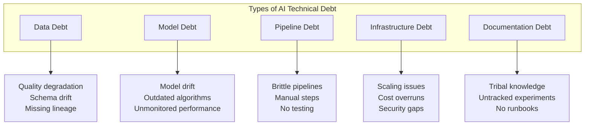
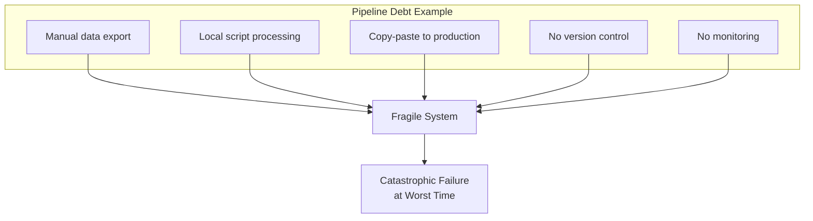
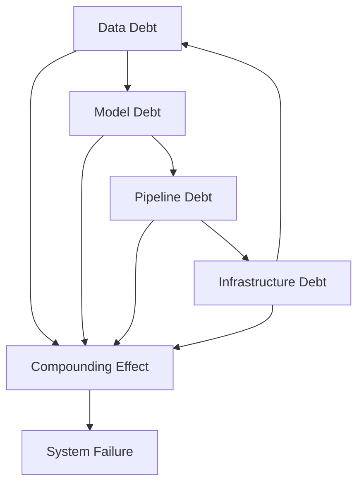
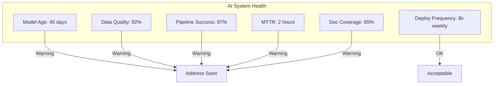
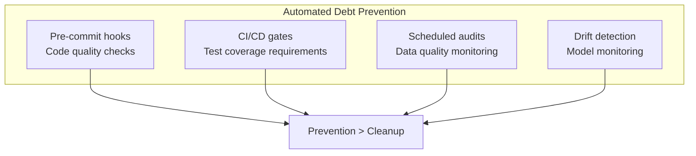

# The True Cost of AI Technical Debt

You've deployed your AI system. It works. The stakeholders are happy.

Six months later, you're drowning in production issues, model accuracy has degraded, and your data scientists are spending 80% of their time on maintenance instead of new features.

Welcome to AI technical debt—and it compounds faster than any debt you've encountered in traditional software.

## AI Debt: A Taxonomy

### Data Debt

The most insidious form of AI debt. Your model is only as good as your data—and data quality erodes constantly.

**How it accumulates:**
- Source schemas change without notification
- Data quality checks aren't comprehensive
- No one tracks data lineage
- Feature stores aren't maintained
- Training and production data diverge

**The cost:**
- Model accuracy degrades silently
- Debugging production issues takes days instead of hours
- Retraining becomes unreliable
- Compliance audits become nightmares

### Model Debt

Models age. The world changes. Algorithms improve. But your production model sits frozen.

**How it accumulates:**
- No scheduled retraining
- No drift detection
- Hyperparameters never revisited
- Better algorithms not evaluated
- A/B testing not implemented

**The cost:**
- Performance declines invisibly
- Competitors surpass you
- Users lose trust
- Eventually, dramatic failure

### Pipeline Debt

The code that moves data and runs models often gets the least attention—and creates the most problems.

**How it accumulates:**
- One-off scripts become permanent
- Manual steps never get automated
- No CI/CD for ML pipelines
- Tests don't exist or don't run
- Dependencies not pinned

**The cost:**
- Deployments are risky and slow
- Only one person can fix problems
- Weekend emergencies
- Failed audits

### Infrastructure Debt

AI systems are resource-intensive. Infrastructure decisions compound.

**How it accumulates:**
- Quick cloud provisioning without cost optimization
- No autoscaling configuration
- GPU resources always on
- Security shortcuts for speed
- No disaster recovery planning

**The cost:**
- Cloud bills balloon unexpectedly
- Performance issues under load
- Security vulnerabilities
- Data loss risk

### Documentation Debt

AI systems have more hidden assumptions than traditional software. When undocumented, they become unmaintainable.

**How it accumulates:**
- Experiments not tracked
- Model cards not written
- Decisions not recorded
- Runbooks not created
- Training data not cataloged

**The cost:**
- Key person leaves, knowledge leaves
- Auditors ask questions no one can answer
- Troubleshooting is archaeology
- New team members take months to ramp up

## The Compound Effect

AI technical debt compounds exponentially because of dependencies:

Data quality issues cause model degradation. Model instability strains pipelines. Pipeline failures demand infrastructure changes. Infrastructure changes break data flows.

Each type of debt makes the others worse.

## Measuring AI Technical Debt

Track these metrics to understand your debt level:

| Metric | Healthy | Warning | Critical |
|--------|---------|---------|----------|
| Model freshness | < 30 days | 30-90 days | > 90 days |
| Data quality score | > 95% | 85-95% | < 85% |
| Pipeline success rate | > 99% | 95-99% | < 95% |
| Deployment frequency | Weekly+ | Monthly | Quarterly+ |
| Mean time to recovery | < 1 hour | 1-4 hours | > 4 hours |
| Documentation coverage | > 80% | 50-80% | < 50% |

## Paying Down the Debt

### Strategy 1: The 20% Rule

Allocate 20% of AI team capacity to debt reduction. Every sprint, every month—consistently.

Not glamorous. But it prevents the debt from becoming unmanageable.

### Strategy 2: Debt Sprints

Periodically, dedicate full sprints to debt reduction. Especially effective after major releases when momentum is low anyway.

### Strategy 3: Debt Budgets

Set debt budgets for projects. "We can ship with X amount of known debt, but no more." Forces explicit tradeoff conversations.

### Strategy 4: Automated Enforcement

Build systems that prevent debt accumulation:

### Strategy 5: Systematic Documentation

Treat documentation as a first-class deliverable:

- Model cards required for every model
- Experiment tracking mandatory
- Architecture decision records for major choices
- Runbooks before production deployment

## The ROI of Debt Reduction

Debt reduction doesn't feel productive. You're not building new features. Leadership doesn't see visible progress.

But the math works:

| Without Debt Reduction | With Debt Reduction |
|------------------------|---------------------|
| 70% time on maintenance | 40% time on maintenance |
| Monthly incidents | Quarterly incidents |
| 2-week debugging cycles | 2-day debugging cycles |
| Key-person dependency | Team resilience |
| Failed audits | Clean audits |

The compound effect works both ways. Reducing debt creates a virtuous cycle of faster development and fewer problems.

## Prevention Over Cure

The best strategy is prevention. Build practices that avoid debt accumulation:

1. **MLOps from day one**: Don't bolt on automation later
2. **Testing culture**: ML systems need tests too
3. **Monitoring first**: Know when things degrade
4. **Documentation requirements**: No shipping without docs
5. **Regular retraining**: Schedule it, automate it
6. **Data quality gates**: Fail fast on bad data

## The Bottom Line

AI technical debt is inevitable. What's not inevitable is letting it become unmanageable.

Track your debt. Allocate time to reduce it. Build systems that prevent it. Treat it as a first-class engineering concern, not an afterthought.

The companies succeeding with AI aren't the ones building the most models. They're the ones maintaining healthy systems over time.

---

*ServiceVision helps established companies build AI systems designed for maintainability from day one. Our MLOps expertise ensures your AI investment pays off over years, not just months. [Let's assess your AI operations](/contact).*
